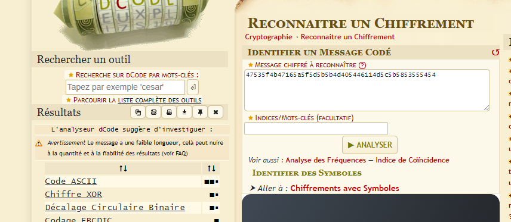
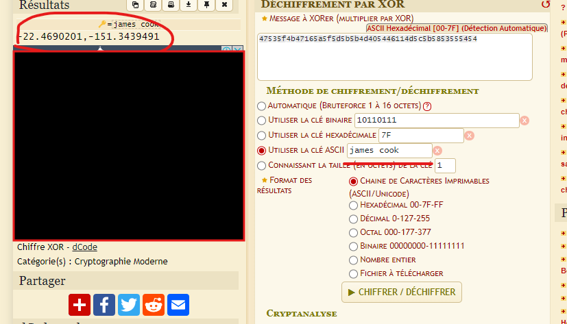
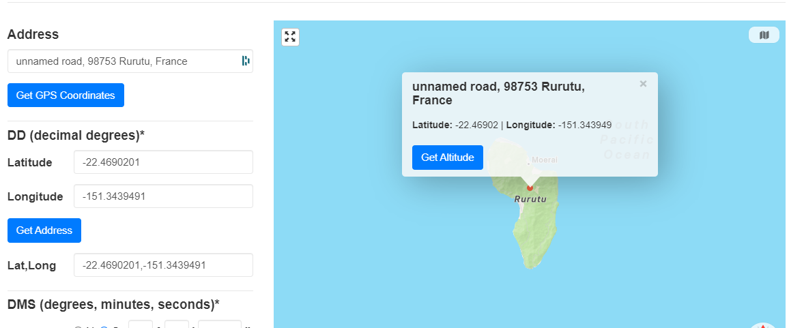

## Scénario

Un groupe de navigateurs intrépides, ont découvert un ancien parchemin lors de leur dernière expédition. Sur ce parchemin, une série de chiffres énigmatiques :

```
47535f4b47165a5f5d5b5b4d405446114d5c5b5853555454
```
Une légende locale raconte que ce code, une fois déchiffré, révélerait l'emplacement d'un trésor caché par l'un des plus grands explorateurs de l'époque, celui qui donna son nom à notre pays : la Nouvelle-Calédonie.

Peut-être que son nom sera utile pour déchiffrer ce message ?

Les scientifiques, perplexes, se tournent vers vous, un expert en cryptographie. Ils vous demandent de les aider à déchiffrer le code et à localiser le trésor.

Format du flag :  ``OPENNC{Nom_de_l_ile}``

**Auteur :** ``Ketsui``


## Résolution

Dans un premier temps on passe notre message dans l'identificateur de dcode.fr



Le titre du challenge est un raccourci si on prend le temps de le lire 10or 10 en romain = X donc XOR.
Mais ce n'est pas trop grave ; pour ceux qui ont essayé le code ASCII, vous avez remarqué que c'était un rabbit hole.

Voyons maintenant notre code XOR. Pour retrouver notre message, il nous faut la clé. Or, une fois encore, en lisant l'énoncé, on voit qu'il y a une référence à James Cook. Et si on essayait ?



```
-22.4690201,-151.3439491
```

Plus qu'a trouver l'île.



flag : ``OPENNC{Rurutu}``