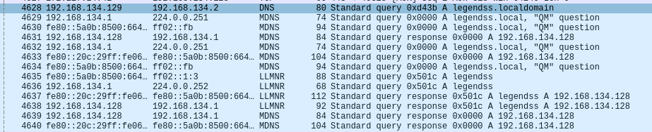
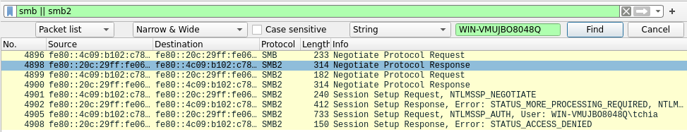
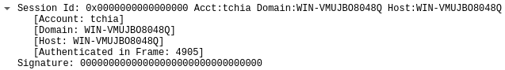

# Question 1

Dans un premier temps on se focus sur LLMNR, je voudrais que tu trouves la mauvaise saisie qui a permis l'exploitation de cette vulnérabilité !

## Résolution
Pour que ça soit plus visuel tout sera fait depuis l'interface graphique (Pas de tshark ici pour les CLI lover T_T).



il y a pas mal de bruit, il suffit simplement de filtrer sur DNS, MDNS et LLMNR afin de retracer la timeline de l'attaque.
On remarque tout de suite que le multicast à été utilisé par la victime issue d'une erreur de frappe "legend**ss**" au lieu de legendes.

flag : ``OPENNC{legendss}``

# Question 2
D'ailleurs je voudrais savoir quelle utilisateur et quelle machine a été victime de cela.
Aide moi à les identifier !

## Résolution
Il y a donc eu une erreur de saisie, la demande et la fausse réponse de notre attaquant. La connexion SMB va donc s'inicier. On filtre par SMB et on regarde ce qu'on a.




flag : ``OPENNC{tchia_WIN-VMUJBO8048Q}``

# Question 3
Mais j'ai un dernier service à te demmander, promis c'est amusant !

Trouve le MDP de l'utilisateur. 

Pour des raisons de temps, etc., nous vous avons mis à disposition une wordlist.

## Résolution

On recupère le hash NTLMv2 dans la capture.


```bash
┌──(ketsui㉿Ketsui)-[~/Downloads]
└─$ hashid hash.txt
--File 'hash.txt'--
Analyzing 'tchia::WIN-VMUJBO8048Q:4D8CD799DF8070AA:6AE66796FF8F8860812E4006D22E5C17:0101000000000000806410DBF47CDA018F8326E142B9C991000000000200080057004B004400430001001E00570049004E002D00430059004700410058003800470058004A005200410004003400570049004E002D00430059004700410058003800470058004A00520041002E0057004B00440043002E004C004F00430041004C000300140057004B00440043002E004C004F00430041004C000500140057004B00440043002E004C004F00430041004C0007000800806410DBF47CDA0106000400020000000800300030000000000000000100000000200000D6BEECFC62A6D40251C044975ADDB925BB6639ACDA4C977B178FE5E41EEC0F950A0010000000000000000000000000000000000009001A0063006900660073002F006C006500670065006E00640073007300000000000000000000000000'
[+] NetNTLMv2
--End of file 'hash.txt'--
```

Nous avons donc un hash de type NetNTLM, nous allons utiliser un outil assez connu appellé **hashcat** disponible nativement sur Kali.

```bash
┌──(ketsui㉿Ketsui)-[~/Downloads]
└─$ hashcat -h | grep -i "NetNTLM"
```

Nous avons notre mode 5600, essayons maintenant : 

```bash
hashcat -m 5600 hash list

TCHIA::WIN-VMUJBO8048Q:4d8cd799df8070aa:6ae66796ff8f8860812e4006d22e5c17:0101000000000000806410dbf47cda018f8326e142b9c991000000000200080057004b004400430001001e00570049004e002d00430059004700410058003800470058004a005200410004003400570049004e002d00430059004700410058003800470058004a00520041002e0057004b00440043002e004c004f00430041004c000300140057004b00440043002e004c004f00430041004c000500140057004b00440043002e004c004f00430041004c0007000800806410dbf47cda0106000400020000000800300030000000000000000100000000200000d6beecfc62a6d40251c044975addb925bb6639acda4c977b178fe5e41eec0f950a0010000000000000000000000000000000000009001a0063006900660073002f006c006500670065006e00640073007300000000000000000000000000:tchia

Session..........: hashcat
Status...........: Cracked
Hash.Mode........: 5600 (NetNTLMv2)
Hash.Target......: TCHIA::WIN-VMUJBO8048Q:4d8cd799df8070aa:6ae66796ff8...000000
Time.Started.....: Fri Aug 16 11:31:44 2024 (0 secs)
Time.Estimated...: Fri Aug 16 11:31:44 2024 (0 secs)
Kernel.Feature...: Pure Kernel
Guess.Base.......: File (list)
Guess.Queue......: 1/1 (100.00%)
Speed.#1.........:     2770 H/s (0.08ms) @ Accel:1024 Loops:1 Thr:1 Vec:8
Recovered........: 1/1 (100.00%) Digests (total), 1/1 (100.00%) Digests (new)
Progress.........: 3/3 (100.00%)
Rejected.........: 0/3 (0.00%)
Restore.Point....: 0/3 (0.00%)
Restore.Sub.#1...: Salt:0 Amplifier:0-1 Iteration:0-1
Candidate.Engine.: Device Generator
Candidates.#1....: Tchia2024 -> tchia
```


flag : ``OPENNC{tchia}``