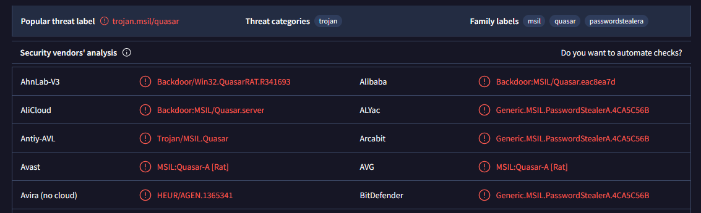
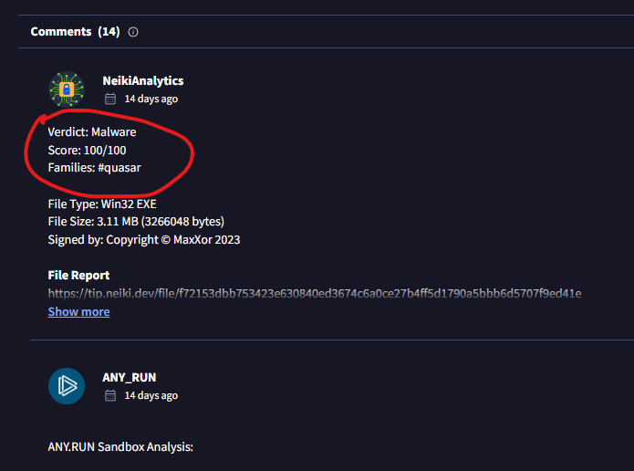
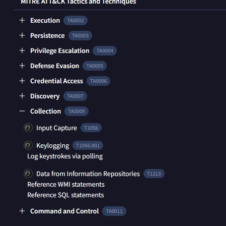

# Mission 1

Retrouver la famille de ce malware.

## Résolution

Avec le hash que nous avons, nous allons le passer en recherche de solutions de cybersécurité. Par exemple nous avons :
- Malware bazaar
- Anyrun
- Virus Total

J'aime particulièrement ce dernier donc nous allons l'utiliser.

On rentre en recherche notre hash : "f72153dbb753423e630840ed3674c6a0ce27b4ff5d1790a5bbb6d5707f9ed41e"

Nous pouvons déja voir la famille, mais dans le doute je vérifie dans l'onglet de la communauté :

flag : ``OPENNC{quasar}``

# Mission 2

Quel sont les 3 identifiants technique Mitre ATT&CK pour la collecte de données par ce malware avant le Command and Control ?

## Résolution

On refait la même chose :
- Entrer notre hash sur Virus Total
- Verifier les behaviors
- Dérouler les collections

flag : ``OPENNC{T1056_T1056.001_T1213}``

