# Mission 1
En tant que défenseur de notre savoir, vous arrivez au CCT et l'on vous fournit cette photo. À vous de jouer pour retrouver où habite ce voleur.

Le flag est la première partie de l'addresse où il réside. Exemple : 

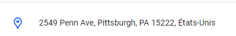

Le flag serait : ``OPENNC{2549_Penn_Ave}``

Si vous pensez avoir le bon flag vous pouvez contacter @Ketsui sur discord pour une vérification.


**Auteur :** ``Ketsui``

## Résolution

!! Suite au cleanup post chall, le compte twitter a été désactivé, le compte google reste actif pendant 3 mois avant d'être complétement supprimé !!


On regarde les métadonnées avec exiftool. 

```bash
┌──(ketsui㉿Ketsui)-[~/Downloads]
└─$ exiftool chall.png
ExifTool Version Number         : 12.76
File Name                       : chall.png
Directory                       : .
File Size                       : 576 kB
File Modification Date/Time     : 2024:04:05 21:39:20+11:00
File Access Date/Time           : 2024:04:05 21:39:20+11:00
File Inode Change Date/Time     : 2024:04:05 21:39:20+11:00
File Permissions                : -rw-r--r--
File Type                       : PNG
File Type Extension             : png
MIME Type                       : image/png
Image Width                     : 1024
Image Height                    : 1024
Bit Depth                       : 8
Color Type                      : Palette
Compression                     : Deflate/Inflate
Filter                          : Adaptive
Interlace                       : Noninterlaced
Palette                         : (Binary data 768 bytes, use -b option to extract)
Author                          : Ulrich Ruelovel
Image Size                      : 1024x1024
Megapixels                      : 1.0
```

Nous avons un auteur visiblement : ``Ulrich Ruelovel``

En faisant des recherches on s'apperçoit qu'il y a un compte twitter (X).
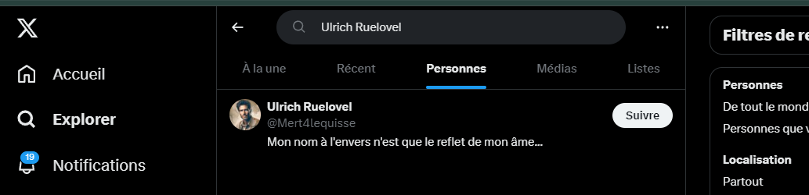


A partir de là plusieurs informations sont interessantes :
- Pseudo
- Un poste et une banniere qui prouve qu'il travaille chez dior.
- Un repost qui prouve qu'il habite à la même addresse que son magasin.


Le pseudo nous prouve l'existance d'un github : Mert4lequisse

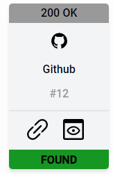

On remarque la présence d'un dépo "MonumPhoto". Il faut chercher dans les Commits afin de découvrir l'adresse email de notre ami : koidarlo69@gmail.com


### Calendrier
Avec notre email nous allons utiliser un tool interessant et gratuit : "Epios". Cela nous permet d'en savoir plus sur le proprietaire.

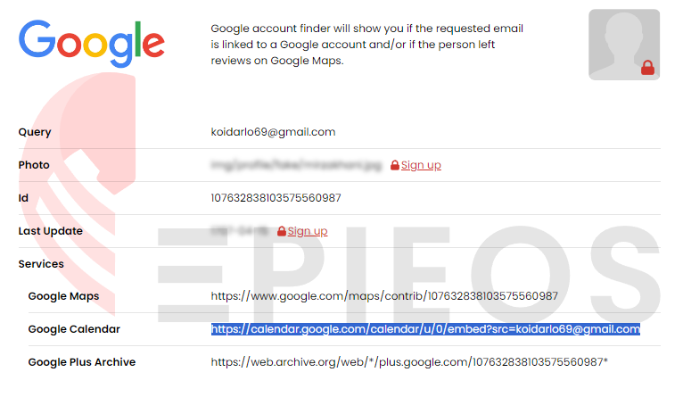

Nous allons jetter un coup d'oeil sur le calendrier.

On s'apercoit qu'il a eu 3 événements en avril 2024.

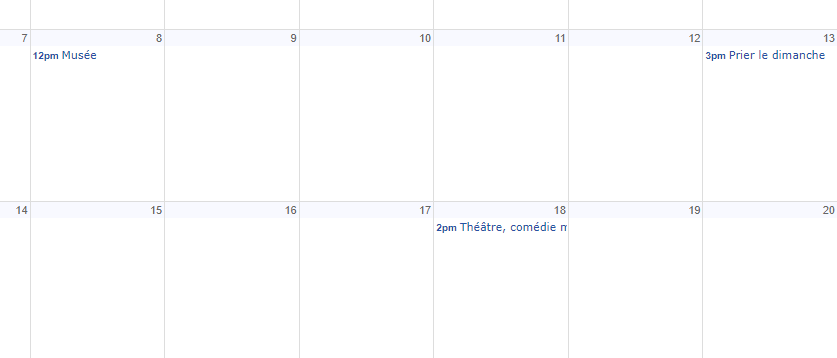


- "Musée" : Museum of Sex, 233 5th Ave, New York, NY 10016, 32 min de marche
- "Prier le dimanche" : The Church of Saint Catherine of Siena, 411 E 68th St, New York, NY 10065, 25 min de marche. ouff ça va faire du sport
- "Théâtre, comédie musical" : Beacon Theatre, 2124 Broadway, New York, NY 10023, Et si je prenais mon vélo ? j'en ai pour 13 minutes. çaaaa va...

Avec ces éléments ont peut très bien imaginer qu'il s'agit des endroits où il est allé en partant de chez lui.

### Trouver son adresse.

Il existe plusieurs solutions pour déterminer les zones en fonction du temps et de la façon de ce déplacer.
Pour ce challenge j'utilise smappen. : https://www.smappen.com/

Il me permet de tracer les zones en fonction des données que j'ai.

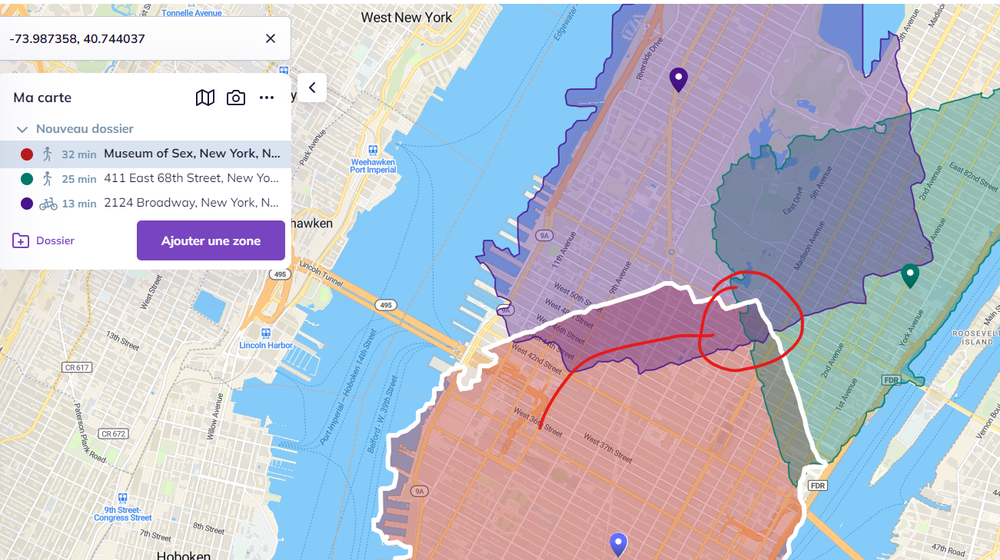


Très vite nous retrouvons une petite zone de convergence. et une chose tape a l'oeil... La présence d'une boutique Christian Dior.

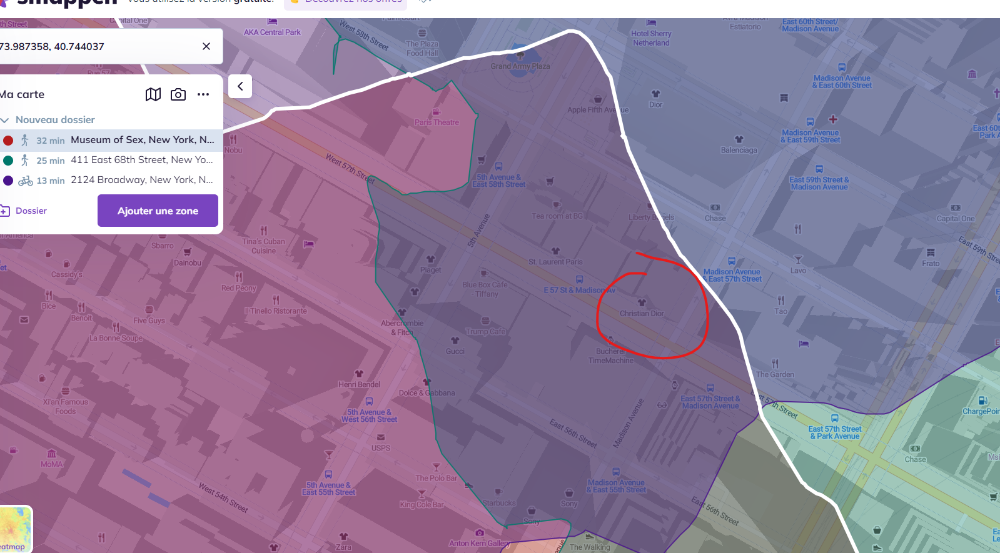


Si vous avez suivi les commentaires / reposts Twitter de Ulrich Ruelovel, vous savez qu'il habite à la même adresse que là où il travaille. à savoir Dior.

Selon Google map l'adresse est la suivante : DIOR New York 57th Street
``21 E 57th St, New York, NY 10022, États-Unis``

flag : ``OPENNC{21_E_57th_St}``


# Mission 2
Votre mission est d'analyser cet email et de découvrir ce qui s'y cache.

## Résolution

On regardant simplement le contenu du fichier on remarque deja beaucoup d'informations : 

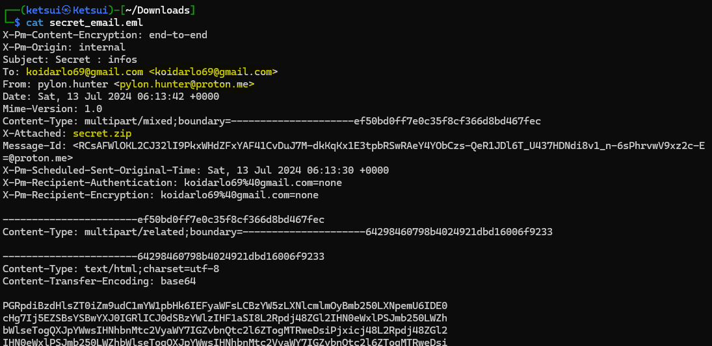

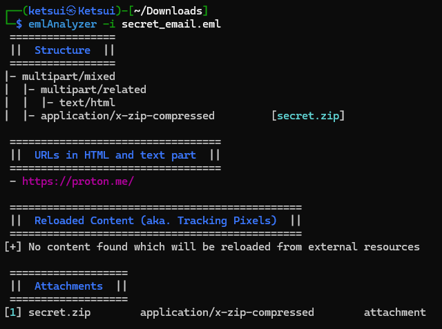

Nous allons nous attarder sur ce qui a l'air d'être une piece-jointe.

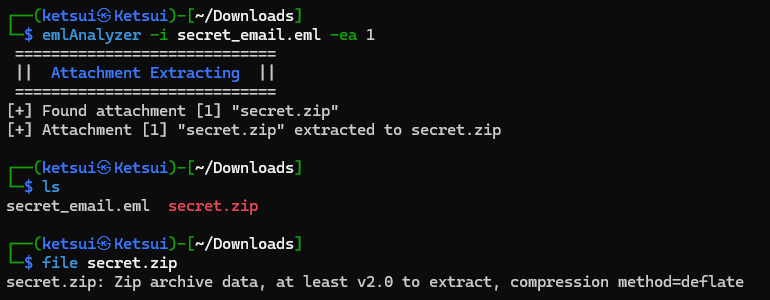

Malheureusement quand on essaye de unzip l'archive on remarque qu'il est protégé par une passphrase.

```bash
┌──(ketsui㉿Ketsui)-[~/Downloads]
└─$ unzip secret.zip
Archive:  secret.zip
[secret.zip] flag.txt password:
```

Nous allons utiliser un tool assez sympatique zip2john, cela va nous permettre d'avoir un hash qui une fois cracké nous donnera la passphrase.


```bash
┌──(ketsui㉿Ketsui)-[~/Downloads/]
└─$ zip2john secret.zip > hashzip
ver 2.0 efh 5455 efh 7875 secret.zip/secret.txt PKZIP Encr: TS_chk, cmplen=124, decmplen=120, crc=7FCE45D2 ts=6CD6 cs=6cd6 type=8

┌──(ketsui㉿Ketsui)-[~/Downloads]
└─$ cat hashzip
secret.zip/flag.txt:$pkzip$1*1*2*0*7f*7b*8a023a49*0*26*8*7f*8a02*6dfc7c75da33c8b696ac0565545886be30e9a99ff546078b63820579957bcb8a72c915d0520fc617bf0a0da2a4cb79636f3eef626d5746d9b3898039675fb18a47a7aa7087a5b78b25d6832ca9870e13a49f3de724dc33cfc8b03c65388921ea344569a1a876412ca2af918370006ba84326ccf1da8c358ad8700f4386497e*$/pkzip$:flag.txt:secret.zip::secret.zip
```

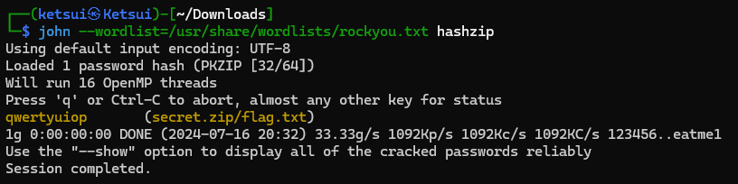


Passphrase : qwertyuiop

```bash
┌──(ketsui㉿Ketsui)-[~/Downloads]
└─$ unzip secret.zip
Archive:  secret.zip
[secret.zip] flag.txt password:
  inflating: flag.txt

┌──(ketsui㉿Ketsui)-[~/Downloads]
└─$ ls
flag.txt  hashzip  secret_email.eml  secret.zip

┌──(ketsui㉿Ketsui)-[~/Downloads]
└─$ cat flag.txt

Voici les informations, rendez vous .... Voici le ....

OPENNC{L4_v0A_eS7_B0nn3}

PS : La suite au next challenge (3/4)
```

Flag : ``OPENNC{L4_v0A_eS7_B0nn3}``


# Mission 3

Trouvez l'endroit où ils doivent se retrouver afin d'intercepter le complice et mettre la main sur cette clé.

Le flag est le site internet de l'établissement faisant office de lieu de rendez-vous. Exemple si le rendez-vous est prévu dans une office de l'OPT alors le flag serait : ``OPENNC{opt.nc}``

## Résolution

Nous avons 2 informations sur apparement un point d'accès. Et si on demandait à chatGPT de nous definir ces termes ? 

SSID (Service Set Identifier) : C'est le nom d'un réseau Wi-Fi. C'est ce que vous voyez lorsque vous cherchez des réseaux sans fil disponibles sur votre appareil. Par exemple, "CaféWiFi" ou "Maison123".

BSSID (Basic Service Set Identifier) : C'est l'adresse MAC unique de l'antenne radio (point d'accès) qui diffuse le réseau Wi-Fi. Il est utilisé pour identifier précisément l'appareil qui émet le réseau. Par exemple, "00:14:22:01:23:45".

```bash
SSID : 4G-UFI-9089
BSSID : 28:be:03:58:af:59 
```

On utilise un outil du nom de Wigle https://wigle.net/.

C'est est une plateforme en ligne qui permet de visualiser des cartes avec des SSID enregistrés par des utilisateurs du monde entier. Vous pouvez alors rechercher des réseaux Wi-Fi dans une région spécifique et voir les points d'accès et leurs SSID sur une carte interactive.

On rentre nos information dans le filtre de droite.

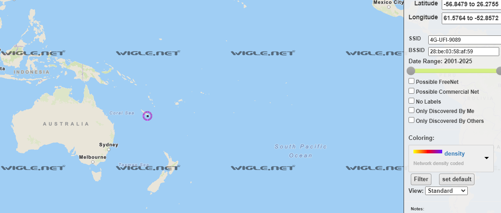

Plus qu'a zoomer.

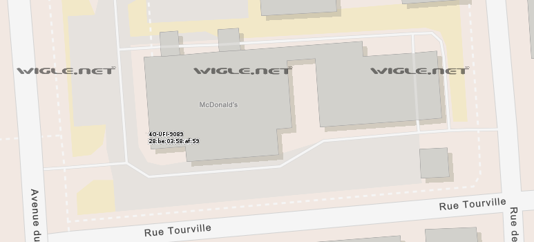

LE VOILA ! 

Trouvons maintenant le site internet de l'établissement pour flaguer.

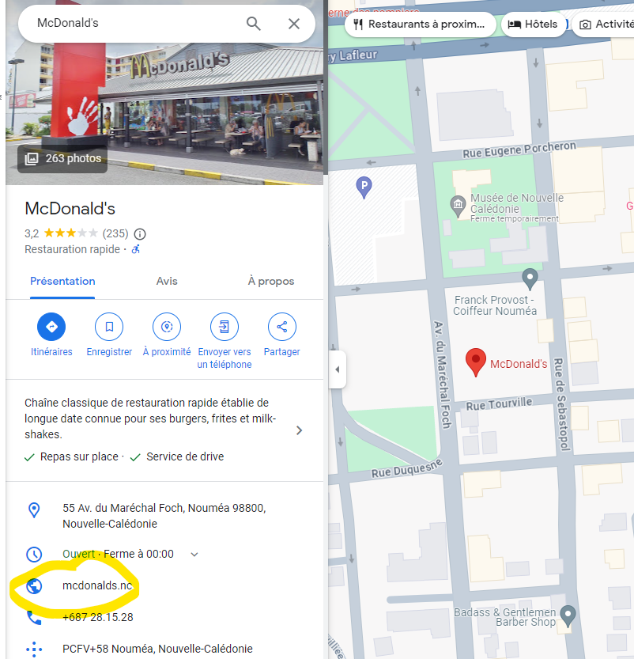

flag : ``flag : OPENNC{mcdonalds.nc}``