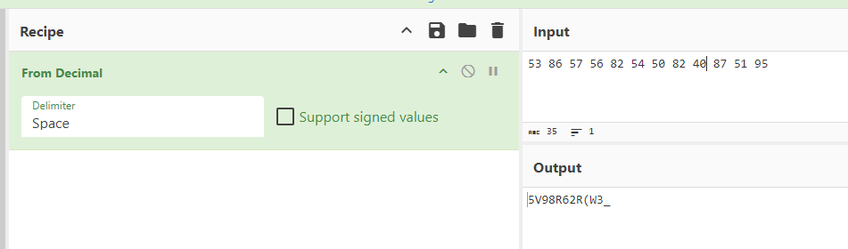
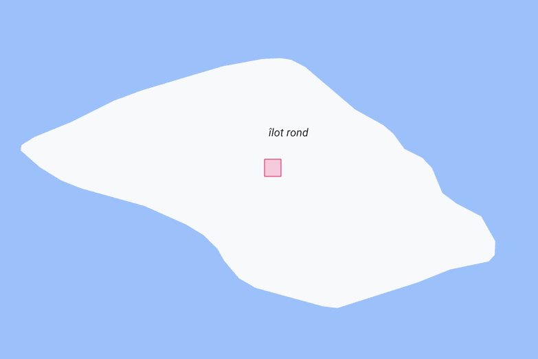

# Scénario

"Il y a plus de 100 ans, une tribu de la mer nommée Araqtr brillait par sa puissance et sa navigation. Le Chef Arak portait un pendentif sacré dont la légende raconte qu'il lui apportait le pouvoir de guérison.

Cependant, un tel pouvoir suscitait d'innombrables haines et jalousies, même au sein de son propre peuple. Il décida donc de cacher ce pendentif. Seuls ses descendants, qui portaient toujours ces valeurs, connaissaient le code menant au trésor.

Au fil du temps, de génération en génération et par peur, les descendants continuèrent à garder ce secret, mais en y ajoutant de la complexité. Car même s'il devait être dévoilé, nul ne saurait l'exploiter.

Nous avons récupéré ce code... C'est à toi de retrouver ce pendentif."


## Mission

Nous avons pu récuperer ce message caché...Il est temps de récuperer ce pendentif. Trouve son emplacement !

```
9M582222+22 
9H9R2222+22 
CHJP2222+22 
9M242222+22 
8MG92222+22 
9M3Q2222+22 
```


**Format du flag :** ***OPENNC{emplacement}***
Sans maj sans accent et un underscore (_) pour les espaces. (taguez un modo si vous n'êtes pas sûr).

Exemples : ***OPENNC{baie_des_citrons}*** ***OPENNC{ilot_maitres}***

**Auteur :** ``Ketsui``

## Résolution

Ce challenge n'est pas aussi facile qu'il en a l'air, car il demande d'être attentif aux détails. Avec du recule il aurait fallu qu'il soit à 1000 points

```
9M582222+22 
9H9R2222+22 
CHJP2222+22 
9M242222+22 
8MG92222+22 
9M3Q2222+22 
```
Avec un peu de recherches google on identifie le format de ces ligne, le **plus.code**.

Néonmoins quand on essaye de trouver les emplacements, il n'y a aucun sens. Pourquoi ne pas les convertir en Lat,Long ? https://plus.codes/ le fait nativement.

```
9M582222+22 : 53.000062,86.000062 
9H9R2222+22 : 57.000062,56.000062 
CHJP2222+22 : 82.000062,54.000062 
9M242222+22 : 50.000062,82.000062 
8MG92222+22 : 40.000062,87.000062 
9M3Q2222+22 : 51.000062,95.000062 
```
Bizarre c'est beaucoup trop clean pour être de vrais emplacement voulu. Tous ces 000062. Donc on va se focus sur les nombres qui changent :

**53 86 57 56 82 54 50 82 40 87 51 95**

Alors là soit vous voyez directement qu'il s'agit de decimal, soit vous êtes aussi fénéant que moi et laissez cyberchief faire le taf :




En regardant bien il y a deux caractères spéciaux, mais le ( est bizarre.
C'est là qu'il faut avoir l'oeil, depuis le début on manipule du plus.code quelque chose me dit qu'au final des plus.code ont caché un autre.

Je remplace le ( par un +, j'enlève le _ et on teste.

5V98R62R+W3
 




Flag : ``OPENNC{ilot_rond}``