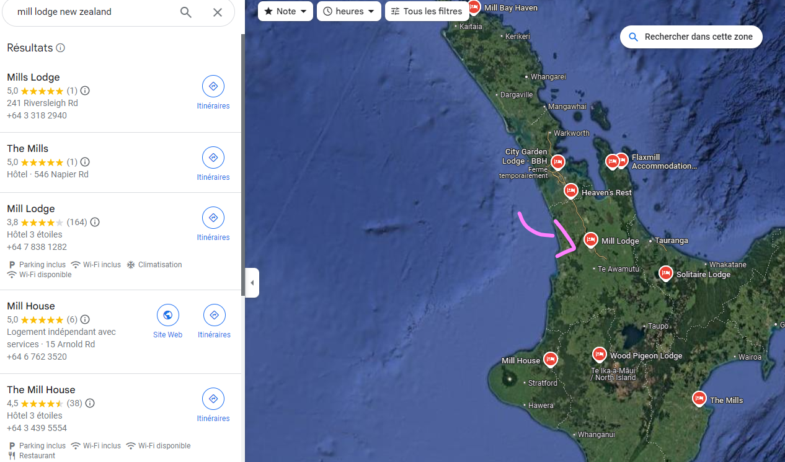
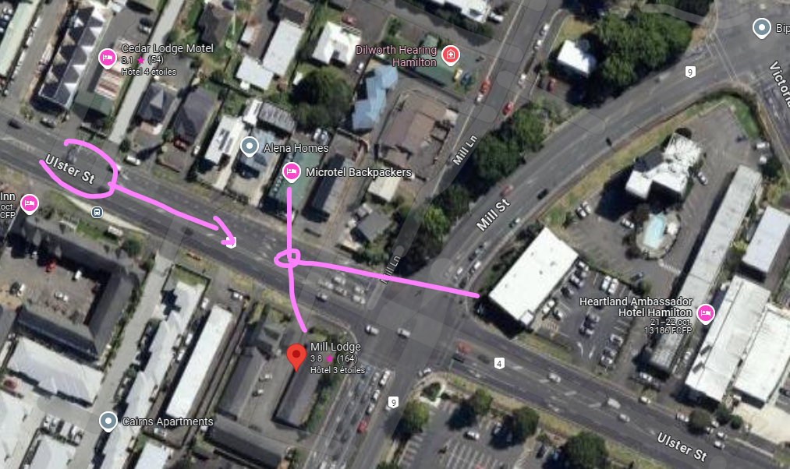

# Missions
Après un spectacle fascinant avec mon père, je me sens reconnaissant d'appartenir à un pays si riche en culture, en légendes, et en diversité. Un pays qui a su rassembler plusieurs cultures pour forger une identité unique. En repensant à ces danses que nous faisions au collège et aux week-ends consacrés au ballon rond, je ne peux m'empêcher de sourire.

Mais une légende me revient aussi en mémoire...

La légende raconte que ce pays est né d'un exploit extraordinaire. Le héros Māui aurait pêché deux poissons géants : l’un étant Te Ika-a-Māui et l’autre Te Waka a Māui.

Je suis sûr que tu sais déjà de quel pays je parle !

Mais allons plus loin... es-tu capable de me donner :

Le code du pays
La ville où je me trouve actuellement
Le nom de la rue sur laquelle je me tiens
Utilise les indices visibles dans l'image et ton expertise OSINT pour résoudre ce mystère. Bonne chance !

Format du flag : ``OPENNC{XX_Ville_Nomdelarue}``

## Résolution

Ici il faut faire attention aux détails : 

On regarde en nouvelle-zélande, il n'y en a pas des masses au même nom.

Flag : ``OPENNC{NZ_Hamilton_Ulster}``