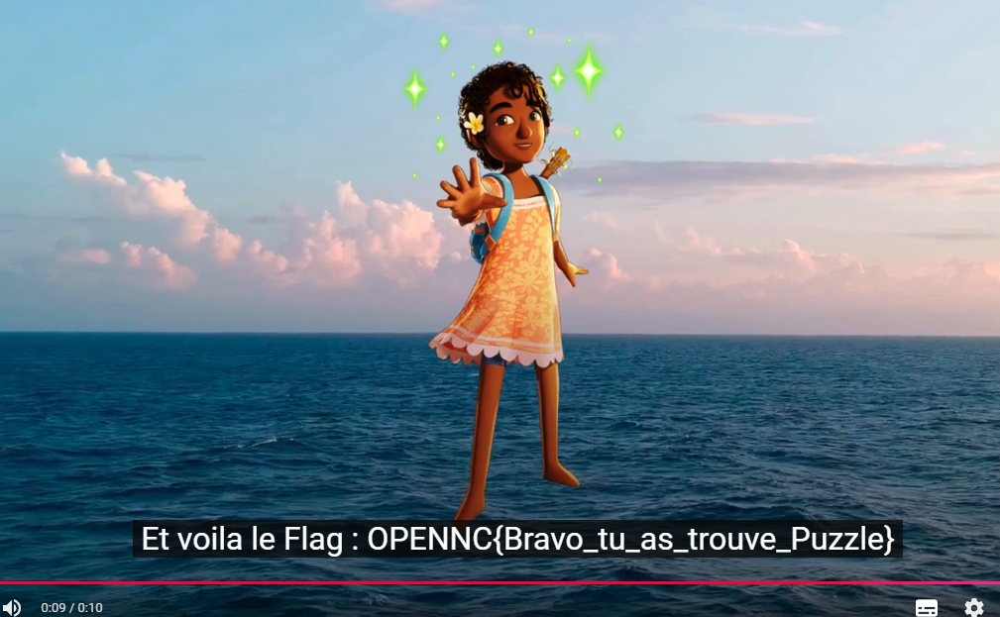

## Mission

A quoi servent ces images ? Trouvez le flag !


## Résolution

Nous avons un fichier zip contenant beaucoup d'images. En visualisant certaines et en fonction de leurs noms on imagine parfaitement que c'est un QR code. 

En déduit qu'il s'agit d'une image en 100 parties (10x10). Voici un exemple de code python permettant de reconstruire notre image.

```python
from PIL import Image

# Nombre de lignes et colonnes de morceaux
nb_lignes = 10
nb_colonnes = 10

# Taille des morceaux (supposée identique pour tous)
largeur_morceau, hauteur_morceau = None, None

# Image finale
image_finale = None

# Parcourir les lignes et colonnes
for y in range(nb_lignes):
    for x in range(nb_colonnes):
        # Ouvrir le morceau
        try:
            morceau = Image.open(f"n_{x}_{y}.png")

            # Initialiser la taille du morceau si on ne la connait pas encore
            if largeur_morceau is None and hauteur_morceau is None:
                largeur_morceau, hauteur_morceau = morceau.size

            # Créer l'image finale si on ne l'a pas déjà faite (première boucle)
            if image_finale is None:
                image_finale = Image.new(morceau.mode, (nb_colonnes * largeur_morceau, nb_lignes * ha>

            # Coller le morceau dans l'image finale
            image_finale.paste(morceau, (x * largeur_morceau, y * hauteur_morceau))
        except FileNotFoundError:
            print(f"Le morceau 'morceau_{x}_{y}.png' est introuvable.")

# Enregistrer l'image finale
if image_finale is not None:
    image_finale.save("image_reconstruite.png")
    print("Image reconstruite avec succès !")
else:
    print("Aucun morceau trouvé, impossible de reconstruire l'image.")
```

Voici notre image, un bon QRcode des familles : 


En le scannant il nous redirige vers une vidéo youtube non indexée : https://youtu.be/FKynmIW5LIA

La voix nous explique qu'il faut parfois penser comme un non voyant pour réellement voir. Et elle a raison...ENFIN non c'est un piège... car les sous-titres disent autre chose : 

```
il faut parfois écouter comme un 
sourd pour réellement comprendre.
```

Et juste après... notre flag.



Flag : ``OPENNC{Bravo_tu_as_trouve_Puzzle}``