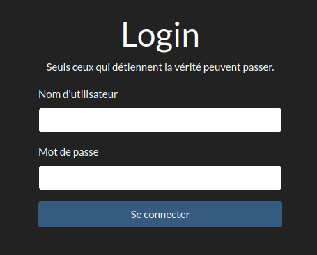
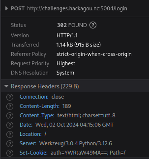
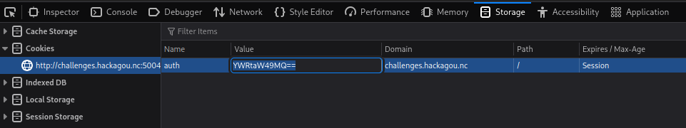

# Write-up

## Analyse de l'application web

En arrivant sur la page d'accueil de l'application, un formulaire de login apparaît.



Quelque soit les informations entrées, l'authentification semble bien se passer puisque la réponse à notre POST est un 302 avec un "Set-Cookie".



Par contre il semblerait que l'accès à l'application soit toujours verrouillé.


En regardant de plus près le cookie transmis, il semblerait que la clé ```auth``` soit encodée en base64 : ```YWRtaW49MA==```

Nous pouvons le décoder facilement via ```echo "YWRtaW49MA==" | base64 -d``` qui nous donne la valeur ```admin=0```.

Nous essayons de créer une nouvelle valeur pour ce cookie en encodant ```admin=1``` en base64 via ```echo -n "admin=1" | base64``` pour obtenir ```YWRtaW49MQ==```.

Nous insérons cette valeur dans le cookie et rechargeons la page.



Nous obtenons bien le flag.

