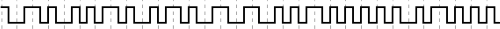

Le défi que vous devrez relever est de décoder un étrange signal émis par l'une des inventions volées par l'équipage de Capt'N Nepo. Le scientifique à l'origine de cette invention était connu pour utiliser des méthodes de transmission du signal avancées pour protéger ses trésors. Vous devrez utiliser vos connaissances dans ce domaine pour décoder ce message et découvrir, peut-être, une piste vers le trésor.

Bonne chance dans cette chasse au trésor, que le vent soit en votre faveur.

_Le format du flag est un MD5 du message découvert : OPENNC{md5dumessagedécouvert}_





## Résolution

On peux voir sur l’image qu’il s’agit d’un signal transmis et qu’il y en a deux types:
* haut puis bas
* bas puis haut

Cela nous fait penser à du binaire envoyé électriquement.

On va donc partir de l’hypothèse suivante : 
* haut puis bas == 0 
* bas puis haut == 1 

Il ne reste plus qu’à traduire l’image et voir ce que donne le message : 
`01001110011001010111000000110000`

On le déchiffre dans [cyberchef](../../../../ressouces/tools/cyberchef.md) : https://gchq.github.io/CyberChef/#recipe=From_Binary('Space',8)&input=MDEwMDExMTAwMTEwMDEwMTAxMTEwMDAwMDAxMTAwMDA&ieol=CRLF&oeol=CR

On obtient : `Nep0`
Au vu du personnage il s’agit donc de la bonne solution.

Il ne reste plus qu’à générer le md5 du message : 
```bash
echo -ne 'Nep0' | md5sum
```

>[!warning] Attention aux options de la commande echo
Bien faire attention d’utiliser `echo -ne` sinon la chaine de caractère qui sera envoyé à md5 contient un retour chariot `\n` qui va donner un autre résultat que celui attendu.

Sinon on peux toujours utiliser notre outil [cyberchef](../../../../ressouces/tools/cyberchef.md) préféré : https://gchq.github.io/CyberChef/#recipe=MD5()&input=TmVwMA&ieol=CRLF&oeol=CR

>[!question]- Spoiler du flag
> OPENNC{a232a03f4c605263fe9594bc3785a861}

