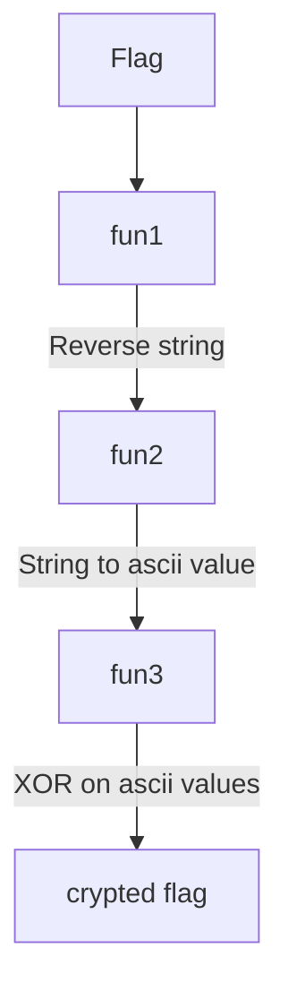
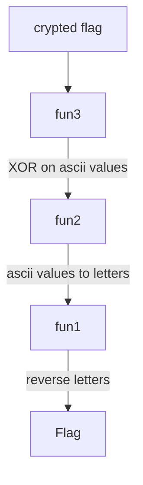

Assis au comptoir de ce bar, vous demandez le Riz Vierge spécial du gérant. Après l'avoir dégusté, vous remarquez un message étrange au fond du bol et interpellez le gérant sur sa signification. Celui-ci vous affirme que sa recette lui a été donnée par un pirate légendaire qui ne cesse de faire des énigmes pour cacher ses trésors, et l'eau qui ruisselle dans le bol finit par créer un message, toujours le même.

Le message est le suivant :

> 160 172 104 107 106 70 104 20 70 126 81 20 85 106 106 81 20 126 81 106 70 106 104 85 106 169 106 117 162 122 113 113 120 119 118

La recette du gérant est jointe.


```python
def fun1(mot):
    newMot = ''
    for i in range(len(mot)):
        newMot += 'a'
    newListMot = list(newMot)
    for i in reversed(list(range(len(newMot)))):
        newListMot[i] = mot[len(mot) - 1 - i]
    return ''.join(newListMot)

def fun2(mot):
    newListMot = []
    for i in mot:
        newListMot.append(ord(i) + 13)
    return newListMot

def fun3(liste):
    xorWord = 42
    newListMot = []
    for i in liste:
        newListMot.append(i ^ xorWord)
    return ' '.join(map(str, newListMot))
    
flag = input('Flag : ')
print(fun3(fun2(fun1(flag))))
```


## Résolution

Ici il faut reverse le code du flag, pour ça on commence à regarder ce que fait chaque fonction : 
```python
def fun1(mot):
    newMot = ''
    for i in range(len(mot)):
        newMot += 'a'
    newListMot = list(newMot)
    for i in reversed(list(range(len(newMot)))):
        newListMot[i] = mot[len(mot) - 1 - i]
    return ''.join(newListMot)
```

### Explication du script
#### fun1
Après execution on se rend compte que cette fonction sert à inverser le mot.
Elle peux se résumer à 
```python
def fun1(mot):
	return mot[::-1]
```

#### fun2
```python
def fun2(mot):
    newListMot = []
    for i in mot:
        newListMot.append(ord(i) - 13)
    return newListMot
```

Cette fonction sert à prendre chaque caractère du mot, de le transformer en son code ASCII et d’y ajouter 13 à cette valeur.

#### fun3
```python
def fun3(liste):
    xorWord = 42
    newListMot = []
    for i in liste:
        newListMot.append(i ^ xorWord)
    return ' '.join(map(str, newListMot))
```

Cette fonction permet de prendre chaque valeur généré par fun2 et d’appliquer un XOR entre cette valeur et 42.

### Reverse du script
Voici le flow du script : 


Pour effectuer l’inverse de ceci il nous faudrait donc faire : 


Voici le script modifiés pour y parvenir :
```python
# on inverse le mot avec une fonction plus courte qui fait la même chose. Mais celle de base suffit aussi
def fun1(mot):
    return ''.join(mot[::-1])

# On retire 13 à la valeur et on converti en lettre
def fun2(mot):
    newListMot = []
    for i in mot:
        newListMot.append(chr(i - 13))
    return newListMot

# on conserve la fonction mais on change le return pour avoir une liste au lieu d'un string
def fun3(liste):
    xorWord = 42
    newListMot = []
    for i in liste:
        newListMot.append(i ^ xorWord)
    return newListMot
    
# flag de l'énoncé
flag = [160, 172, 104, 107, 106, 70, 104, 20, 70, 126, 81, 20, 85, 106, 106, 81, 20, 126, 81, 106, 70, 106, 104, 85, 106, 169, 106, 117, 162, 122, 113, 113, 120, 119, 118]
print(fun1(fun2(fun3(flag))))
```

>[!question]- Spoiler du flag
> OPENNC{R3v3r53_3nG1n33r1nG_15_345y}

