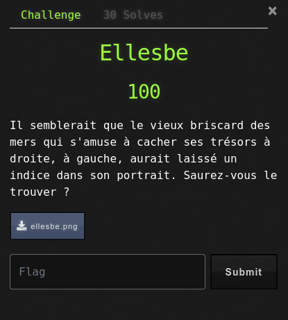
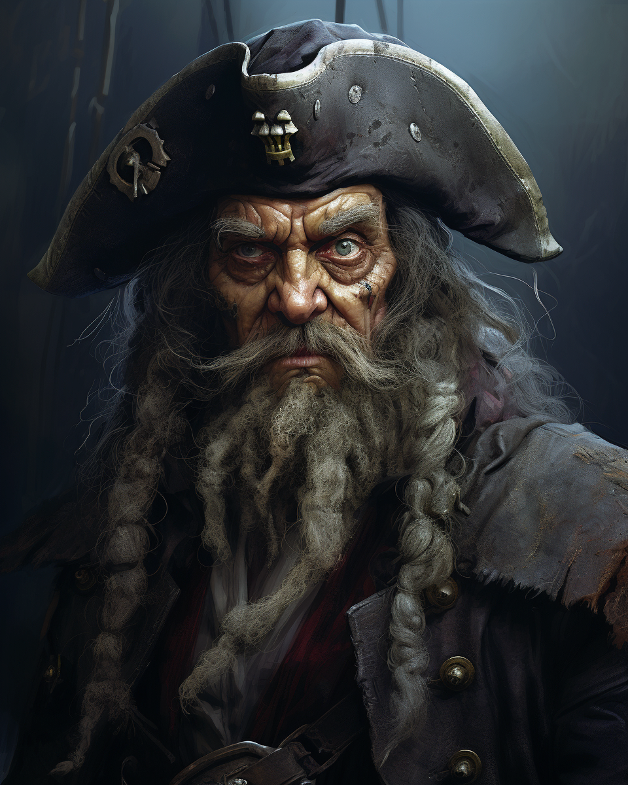
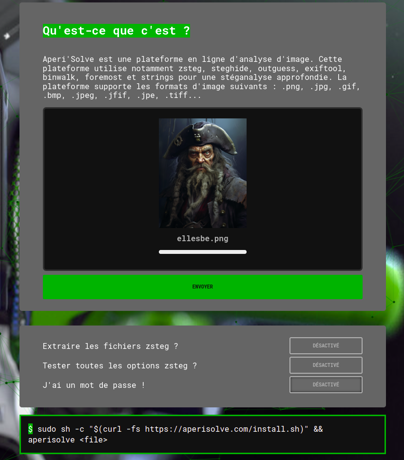
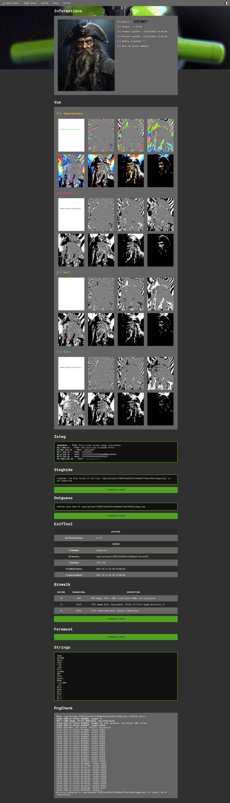
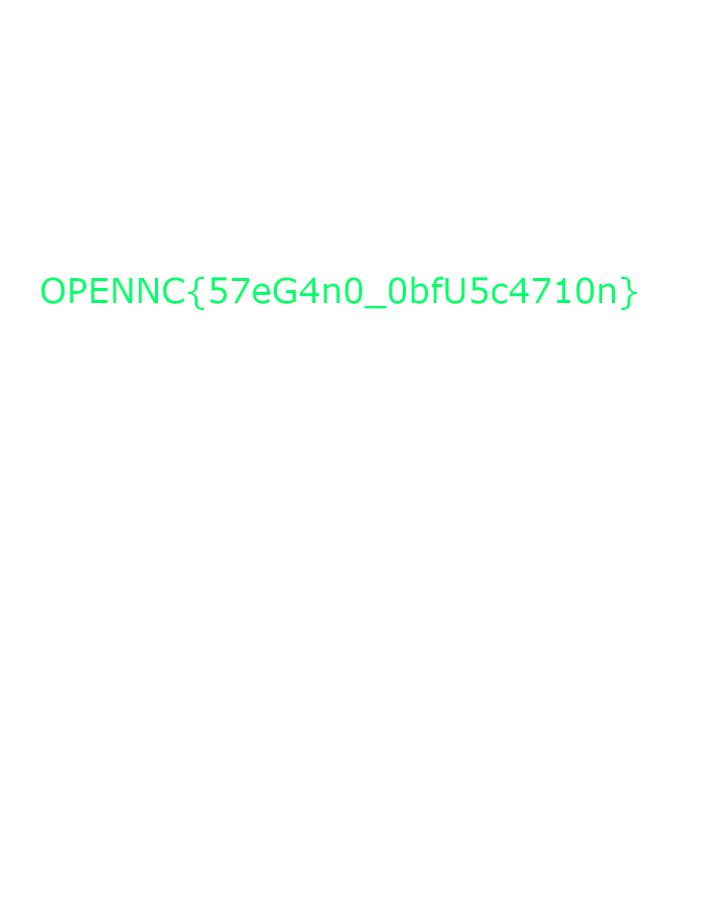

# Ellesbe

## Énoncé

Il semblerait que le vieux briscard des mers qui s'amuse à cacher ses trésors à droite, à gauche, aurait laissé un indice dans son portrait. Saurez-vous le trouver ?

## Write-Up

Le challenge nous met à disposition une image de laquelle nous devons extraire le flag.
En général, lorsqu'il s'agit de stéganographie, je pars sur [Aperi'Solve](https://www.aperisolve.com/) afin de ratisser large.

Le résultat apparaît assez vite puisque la première image, issu de la détection de superposition d'images contient le flag.

### Méthode alternative : stegoveritas

`exiftool` ne révèle rien dans les métadonnées, et `binwalk` non plus.

`file` indique que `ellesbe.png: PNG image data, 960 x 1200, 8-bit/color RGBA, non-interlaced` : c'est une image en 8 bits, donc un message peut être caché et révélé avec le bon filtre de couleur.

[stegoveritas](https://github.com/bannsec/stegoVeritas) fait davantage de vérifications : il applique notamment les 256 filtres de couleur sur l'image et dépose les résultats dans un dossier. Le flag apparaît sur l'une des images générées.

Le flag est donc :
OPENNC{57eG4n0_0bfU5c4710n}
