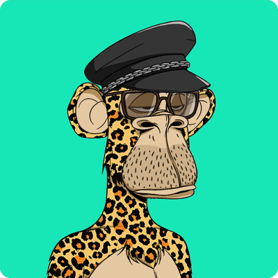
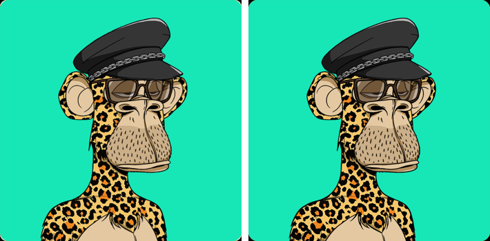

# SingeBlasé

Connor Sturdy, un corsaire bien connu pour son obsession du Capt'N Nepo, aurait réussi à trouver sur le marché noir une peinture faite par Jules, le fils du Capt'N. Ne la trouvant pas à son goût, Connor décide de la revendre 17 jours plus tard.

Saurez-vous retrouver le gain total de cette opération pour Connor à partir de la photo prise du tableau ?



_Format du flag : OPENNC{md5_du_gain}_

_Exemple si le gain est de 1.35 BTC avec md5sum("1.35BTC") : OPENNC{dd720cffa415667815031441bf80b226}_

**Challenge créé avec la contribution de la Police Nationale, passe les voir sur leur stand avec ton chapeau blanc pour parler cyber**

## Résolution

### Identifier le tableau

Le style ne laisse pas de doute : c'est un **Bored Ape Yacht Club** (BAYC), la collection NFT de 10 000 singes du contrat `0xbc4ca0eda7647a8ab7c2061c2e118a18a936f13d`. Chaque singe est une combinaison de traits, publiés dans ses métadonnées.

On relève les traits visibles sur l'image :

| Trait | Valeur BAYC |
|---|---|
| Background | Aquamarine (fond turquoise) |
| Fur | Cheetah (pelage de guépard) |
| Hat | S&m Hat (casquette de cuir noire à chaîne) |
| Eyes | Scumbag (lunettes, paupières mi-closes) |
| Mouth | Bored Unshaven (barbe de trois jours) |
| Clothes | aucun |

Une recherche d'image inversée (Google Lens) suffit en général. Pour une identification certaine, on filtre la base complète des traits ([skogard/apebase](https://github.com/skogard/apebase), fichier `db`, un JSON par singe) :

```python
import json
apes = [json.loads(l) for l in open("db") if l.strip()]
traits = lambda a: {x["trait_type"]: x["value"] for x in a["metadata"]["attributes"]}
for a in apes:
    t = traits(a)
    if t.get("Fur") == "Cheetah" and t.get("Background") == "Aquamarine" and t.get("Hat") == "S&m Hat":
        print(a["id"], t)
# 6328 {'Hat': 'S&m Hat', 'Eyes': 'Scumbag', 'Mouth': 'Bored Unshaven', 'Fur': 'Cheetah', 'Background': 'Aquamarine'}
```

Un seul résultat : le **BAYC #6328**. Son image officielle (IPFS `QmStb3AF2ygsXy2kKA3Pt3ryF8ANGE88FNtapTwECjnCgy`) est identique à celle du challenge :



### Retrouver l'achat et la revente

On récupère l'historique des transferts du token #6328 sur un explorateur (Etherscan, ou l'API ouverte de Blockscout si Cloudflare bloque) :

```bash
curl -s 'https://eth.blockscout.com/api/v2/tokens/0xbc4ca0eda7647a8ab7c2061c2e118a18a936f13d/instances/6328/transfers'
```

| Date (UTC) | De | Vers | Méthode |
|---|---|---|---|
| 2021-05-01 08:00 | `0x0000…0000` | `0xFEEF…7276` | `mintApe` |
| 2021-05-02 07:29 | `0xFEEF…7276` | `0x4049…54ed` | `atomicMatch_` (OpenSea) |
| 2021-05-19 00:28 | `0x4049…54ed` | `0xAb05…51f1` | `atomicMatch_` (OpenSea) |
| 2024-06-16 20:57 | `0xAb05…51f1` | `0x7c19…000C` | … |

Le portefeuille `0x40497b82aDDF6a6531ff0387801AdAC894Fa54ed` (Connor) achète le singe le 2 mai 2021 et le revend le 19 mai 2021, soit **17 jours plus tard**. Le montant de chaque vente OpenSea (Wyvern) est la valeur ETH envoyée par l'acheteur dans la transaction :

```bash
curl -s 'https://eth.blockscout.com/api/v2/transactions/<hash>' | jq '.value'
```

| Opération | Transaction | Payé par | Montant |
|---|---|---|---|
| Achat | [`0x0ed35d8e…2b2fa`](https://etherscan.io/tx/0x0ed35d8e3ab7c31a35d904ff824ed9ef7de5083e26ab1f4338e1b9cd3ce2b2fa) | Connor | **0,35 ETH** |
| Revente | [`0x1d047d00…4e7bd`](https://etherscan.io/tx/0x1d047d006d21f240a9446736bddebf0b1f920cb1a9f699cf63fb1fa66f74e7bd) | `0xAb05…51f1` | **0,40 ETH** |

Gain = 0,40 − 0,35 = **0,05 ETH**. Il s'agit du gain brut : les frais OpenSea, les royalties et le gas ne sont pas déduits.

### Flag

Même format que l'exemple de l'énoncé, avec l'unité ETH :

```bash
t=$(echo -n 0.05ETH | md5sum | awk '{print $1}'); echo "OPENNC{$t}"
```

>[!question]- Spoiler du flag
> OPENNC{7f8d327c3b998f12c5a1aed977e46c5e}
