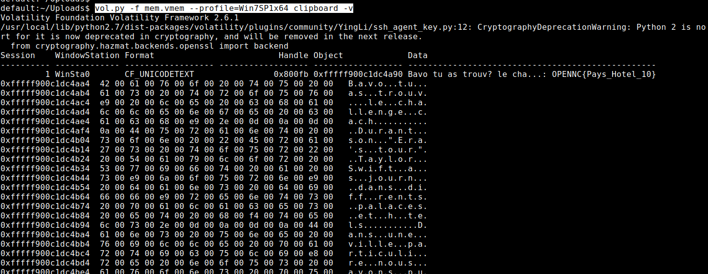
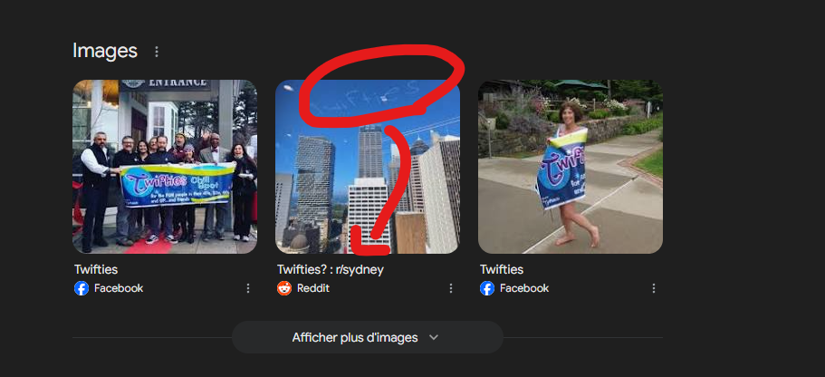
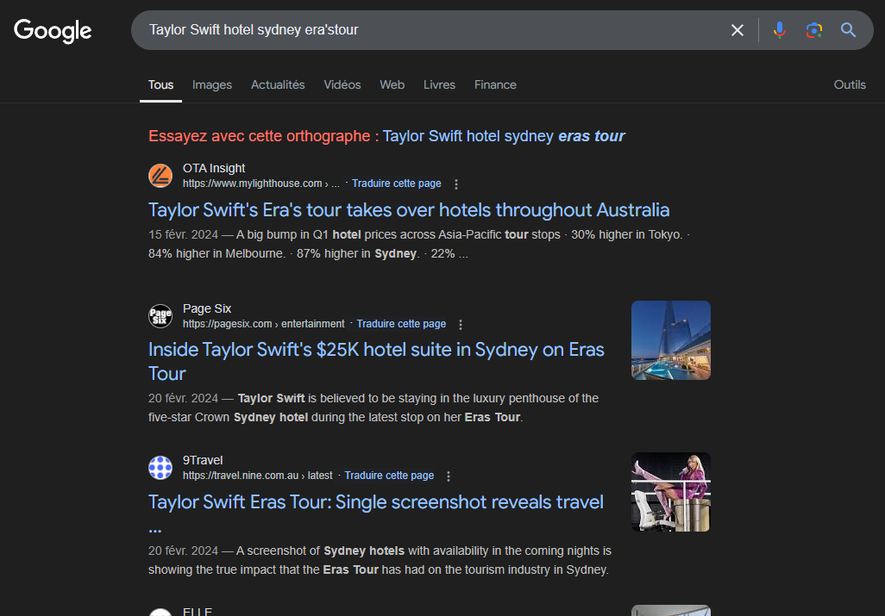
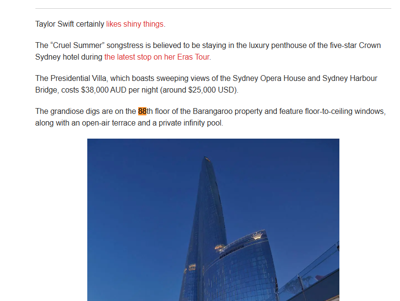

## Enoncé caché

L'énnoncé se cachait dans le Challenge l'Agence. En effet si vous regardiez (ou tombiez dessus de façon random avec un strings) le clipboard du dump, les informations s'affichaient.

```
vol.py -f mem.vmem --profile=Win7SP1x64 clipboard -v
```



Après un cleanup :

```
Bravo tu as trouvé le challenge chaché. Durant son "Era's tour" taylor Swift a séjourné dans différents palaces et hôtels. Dans une ville particulière nous avons pu voir apparaitre "TWIFTIES" dans le ciel, faisant référence au swifties et Travis Kelce. Ta mission est de me donner le nom de cette ville, le nom de l'hotel où elle a séjourné et le numéro de l'étage de l'appartement. Bonne chance Swiftie ! format du flag : OPENNC{Pays_Hotel_10}
```

Certains ont pu remarqué que je demandais la ville mais dans l'exemple de flag il y avait le Pays, dans tous les cas, ville ou pays, le flag fonctionnait.


## Résolution

Une fois que vous avez trouvé l'énoncé, y'a plus qu'a :


Twifties dans le ciel ??

Une simple recherche google de mot "TWIFTIES" nous donne une image :


Nous avons donc notre ville.

L'hotel ? 




https://pagesix.com/2024/02/20/entertainment/inside-taylor-swifts-25k-hotel-suite-in-sydney-on-eras-tour/

L'étage :



flags possibles :
 - ``OPENNC{Sydney_Crown_88}``
 - ``OPENNC{Sydney_Crown-Tower_88}``
 - ``OPENNC{Australie_Crown_88}``
 - ``OPENNC{Australie_Crown-Tower_88}``
 - ``OPENNC{Australie_Crown-Tower-Sydney_88}``


Easy non ?


