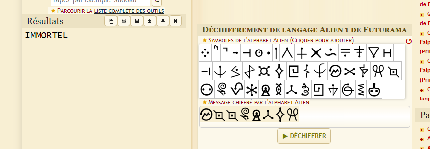

## Scénario

Sur une île mystérieuse du Pacifique, une ancienne légende raconte l'histoire de Te Fiti, une déesse créatrice qui, dans sa générosité, offrit une perle magique à un peuple insulaire. Cette perle avait le pouvoir de protéger l'île des forces destructrices de l'océan et d'assurer la prospérité de ses habitants. Cependant, un jour, un prince avide, Tui, déroba la perle, croyant qu'il pourrait en tirer un pouvoir personnel illimité.

Furieuse, Te Fiti récupera et maudit la perle en la cachant dans un temple ancien, protégée par des énigmes cryptographiques complexes que seuls les plus sages et les plus désintéressés peuvent résoudre.

Ce temple a été récemment retrouvée par un groupe d'explorateurs modernes. Malheureusement, ces derniers n'ont pas compris la puissance et les dangers d'y pénétrer et ont déclenché la malédiction, ce qui a provoqué une série de catastrophes naturelles dans le Pacifique.

C'est à vous de déchiffrer le message qui permettra de refermer la porte du donjon et briser la malédiction.

Format du flag :  ``OPENNC{mot}``

**Auteur :** ``Ketsui``

**Image du challenge réalisée par :** ``@Toudou_ben`` 

## Résolution

Quand il y a des symboles qu'on ne connait pas il y a deux possibilités, soit faire une recherche inversé via google image, yandex ou autres. Soit aller sur : https://www.dcode.fr/chiffres-symboles et comparer.

flag : ``OPENNC{immortel}``