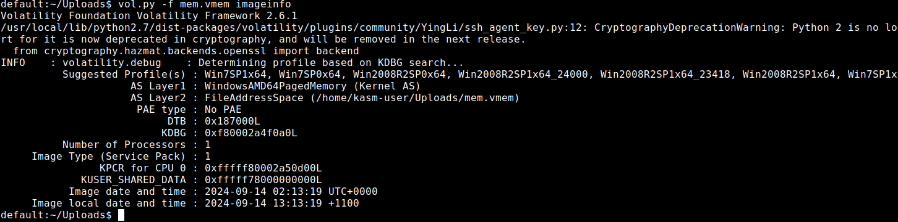
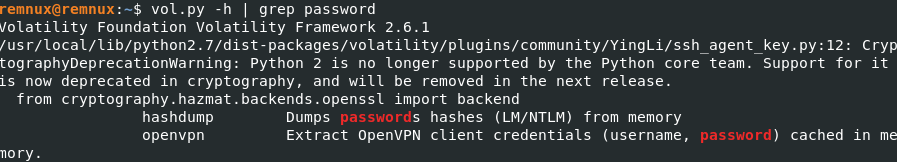
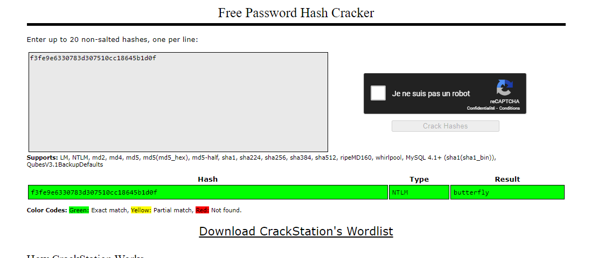

L'Ordre Cyber d'Océanie est une agence d'importance vitale pour la protection des contes et légendes.

Un jour, vous tombez sur une offre d'emploi un peu particulière, qui ressemble à un test technique :

"Si vous souhaitez rejoindre l'agence et travailler avec les élites, voici un dump mémoire. Trouvez le mot de passe cet idiot de ketsui."

Format du flag : ``OPENNC{mdp}``


# Résolution

Avant de commencer, parlons de la distribution. En forensic c'est une question de préférences. Il est possible de faire depuis une windows mais personnellement j'utilise REMnux : https://docs.remnux.org/install-distro/get-virtual-appliance

Nous avons un dump mémoire, l'outil que je vais utiliser pour l'analyser est volatility, plus spécifiquement la version 2, car la version 3 manque encore de fonctionnalités.

Dans un premier temps il faut déterminer le profile de l'OS.




OK pas mal, on identifie un ```Win7SP1x64```

Allons voir ce que volatility nous offre en therme de fonction lié à la récupération de passwords :



Tiens, hashdump à l'air bien, on test :

```
default:~/Uploads$ vol.py -f mem.vmem --profile=Win7SP1x64 hashdump

Administrateur:500:aad3b435b51404eeaad3b435b51404ee:31d6cfe0d16ae931b73c59d7e0c089c0:::
Invit:501:aad3b435b51404eeaad3b435b51404ee:31d6cfe0d16ae931b73c59d7e0c089c0:::
ketsui:1000:aad3b435b51404eeaad3b435b51404ee:f3fe9e6330783d307510cc18645b1d0f:::
```

On passe le hash dans crackstation



Flag : OPENNC{butterfly}