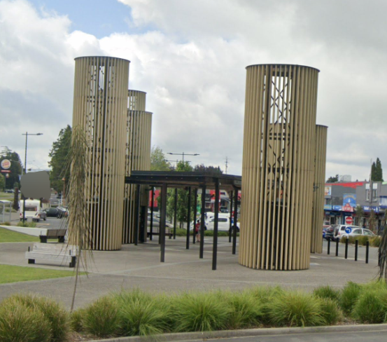
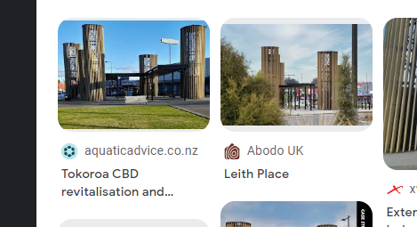
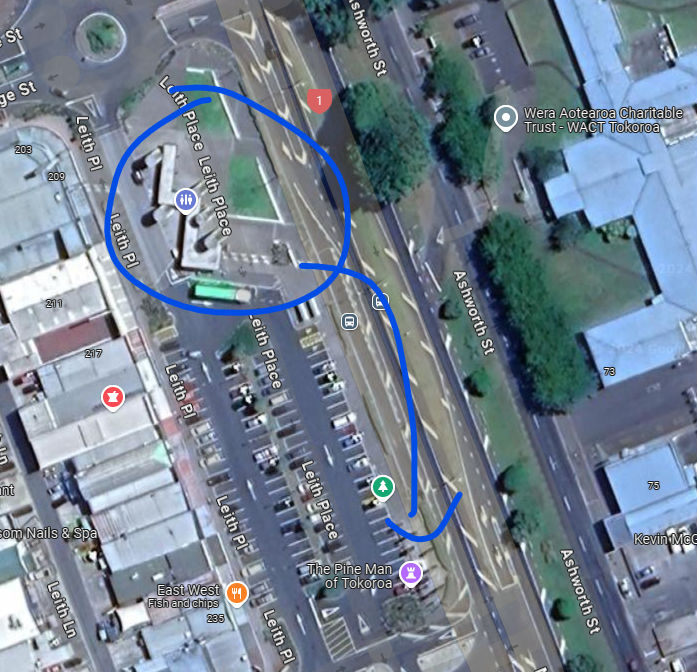
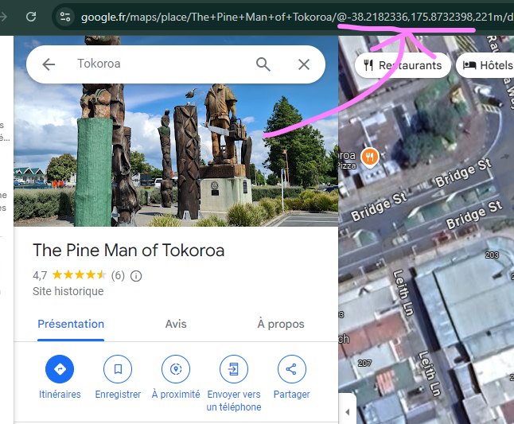

# Mission 

Votre cousin, un historien passionné et toujours à l’affût d’aventures insolites, vous envoie une photo prise avec sa toute nouvelle caméra 360°. Fidèle à son sens de l'humour et son goût pour les énigmes, il vous lance un défi : retrouver une sculpture célèbre à proximité de l'endroit où la photo a été prise.

Excité par le défi, vous ouvrez la photo 360, mais à votre grande surprise, aucune sculpture n’est visible ! A-t-il fait une erreur ou vous a-t-il tendu un piège astucieux ? Il laisse tout de même un indice mystérieux :
"C'est une installation lourde de sens pour les habitants, rendant hommage aux familles et à cette industrie, aussi difficile qu'importante, qui a tant apporté à la région."

À l’aide de la photo 360 et de cet indice, trouvez les coordonnées GPS exactes de la sculpture/installation en utilisant Google Maps.

2 chiffres après les points

## Résolution

On se focus sur un élément remarquable de la photo : 

Une recherche inversée google lens : 

On check sur google map : 

On a l'installation et la position GPS

Flag : ``OPENNC{-38.21,175.87}`` ou Flag : ``OPENNC{The_Pine_Man_of_Tokoroa}``