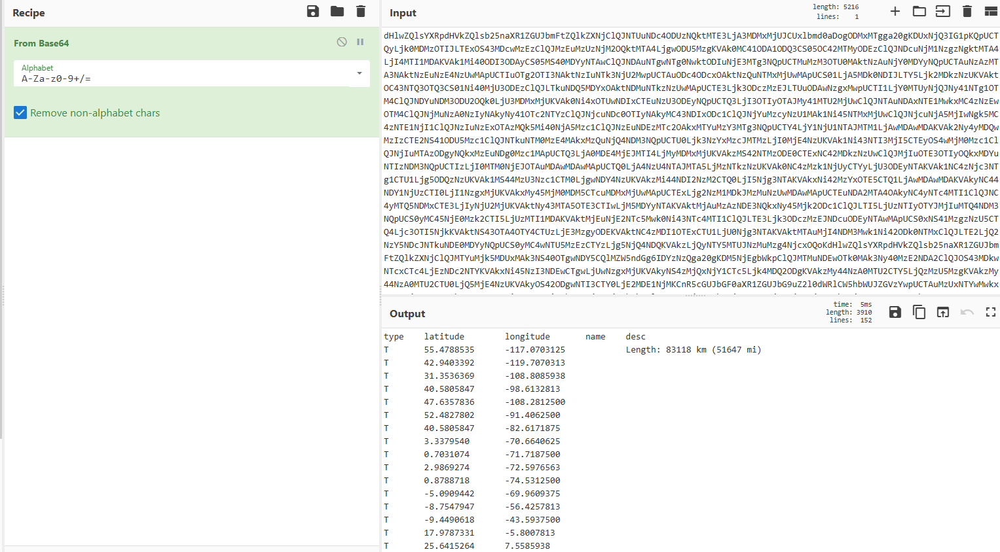
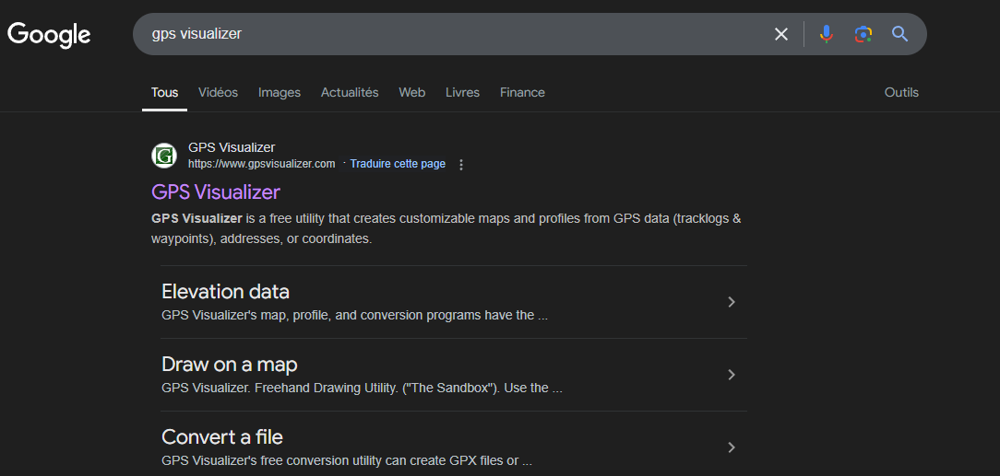
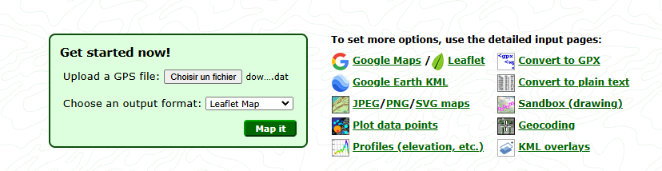
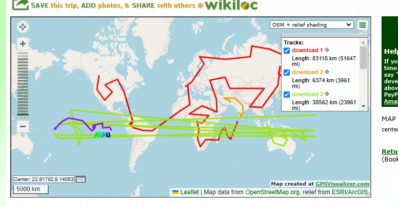
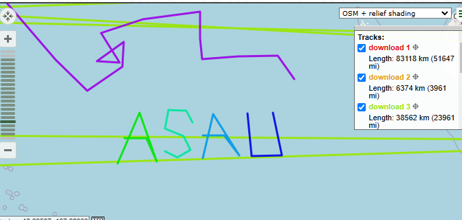
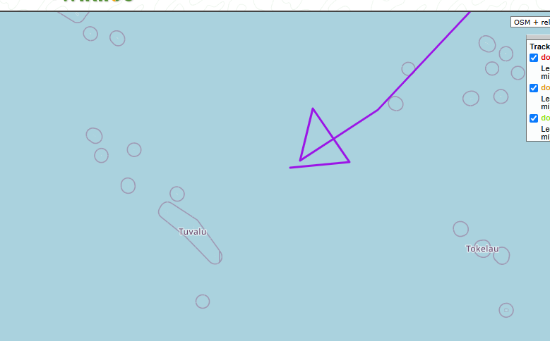
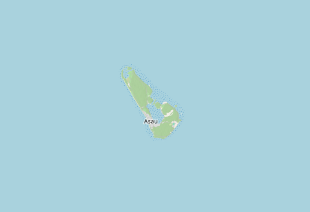

# énoncé

Il y a des siècles, le grand navigateur AteuLofe traversait les vastes océans de l’Océanie, en quête d’un trésor inestimable. Ses aventures ont alimenté de nombreuses légendes, mais aucune n’a jamais révélé l’emplacement exact de son trésor caché. Beaucoup disent qu’AteuLofe a enfoui son trésor sur une île mystérieuse, quelque part dans les mers de l’Océanie, avant de disparaître sans laisser de trace.

Ton oncle, un chercheur passionné par cette légende, a consacré toute sa vie à la quête de ce trésor. Des années de recherches, d’expéditions dangereuses et de mystères inexpliqués ont mené ton oncle de plus en plus loin, jusqu’à ce qu’il disparaisse lui-même, laissant derrière lui un mystère encore plus grand.

Avant de perdre tout contact avec lui, il a réussi à t’envoyer quelques données via satellite. Ce sont les seules traces de son dernier voyage. Depuis, plus personne n’a entendu parler de lui.

Mais tu sais qu’il a découvert quelque chose. Le trésor d’AteuLofe est à portée de main, et les indices qu’il t’a laissés sont la clé pour le retrouver. En tant que son neveu/nièce, tu te dois de résoudre ce mystère, de marcher sur ses pas et, qui sait, peut-être de le retrouver.

Format du flag OPENNC{NOMDELILE}

# Résolution

Nous avons un fichier avec du base64 :

Tiens il y a beaucoup de coordonées GPS, beaucoup trop. C'est comme s'il y avait un tracé à faire.

Je veux donc visualiser ce tracé, je cherche un tool en ligne : 

Je télécharge l'output de cyberchief et l'importe ici pour voir :

Oh wow il a bougé ton oncle...

Mais attends, un mot apparait :

ASAU ? mais attends, vers où cette flêche nous emmene ?

Tuvalu ? non regardons de plus près :

flag : OPENNC{ASAU}