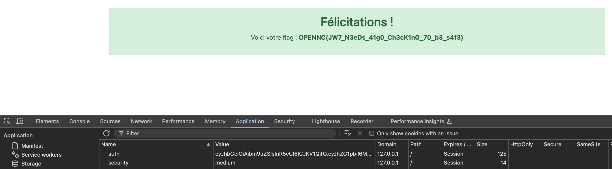

# Write-up

## Analyse de l'application web

En arrivant sur la page d'accueil de l'application, si nous n'avons pas nettoyé les cookies, un accès refusé apparaît. Il est nécessaire de supprimer le cookie mis en place par le précédent challenge.


Encore une fois, nous tombons sur un formulaire de login qui accepte toutes les informations d'authentification.


Encore une fois nous recevons un JWT comme cookie et l'accès à l'application nous est toujours refusé.


La structure du payload nous donne toujours un format du type : ```{"admin":0,"exp":EPOCH}```.

Un indice nous indique que ```l'apparence peut être trompeuse. Ce que tu crois être solide peut ne pas l'être```. Cela laisse penser qu'un mécanisme de sécurité au sein du JWT n'est pas si solide que l'on pourrait le penser.

Une [recherche des différentes vulnérabilités sur les JWT](https://portswigger.net/web-security/jwt#accepting-tokens-with-no-signature) nous indique qu'il est possible, dans le cadre d'une mauvaise implémentation de ceux-ci, de forcer l'algorithme de signature pour ```none``` ce qui pourrait permettre de ne pas avoir à signer notre JWT.

# Modification de l'algorithme de signature

Nous récupérons donc la partie header du JWT et y modifions l'algorithme pour :

```json
{
    "alg": "none",
    "typ": "JWT"
}
```
Nous modifions aussi le payload pour avoir la clé ```admin``` à ```1```.

```json
{
  "admin": 1,
  "exp": 1728847989
}
```

Nous encodons en base64 ces deux éléments et remplaçons les parties correspondantes du JWT, séparées par un point, dans le cookie de l'application pour récupérer le flag.


