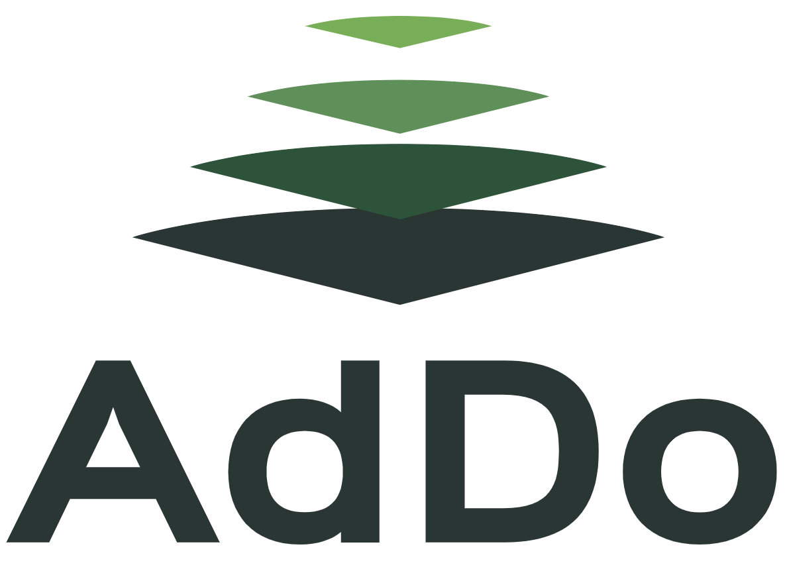

# DNS Record type A (2025)
Catégorie : EZRun — Points : 10 — Auteur : k3rhu0n

## Énoncé
Ned : On a besoin d'un expert [Forensic](https://fr.wikipedia.org/wiki/Analyse_forensique) sur le territoire pour nous aider, mais avec NEURONA tous les spécialistes se montrent discrets, car elle surveille tout depuis qu'elle a été compromise. Tauira m'a parlé de quelqu'un mais pour le contacter il faut cibler une adresse IP spécifique. Le logo ci-dessous t'aidera à la retrouver. Tu peux t'en charger ?

Jocelyne : OK !



Ta mission : Aide Jocelyne à retrouver l'adresse IP.

Le flag est de la forme : `OPENNC{IP}`

## Résolution
Le logo est celui d'**AdDo**, société calédonienne (formation / expertise cyber, partenaire du HacKagou) dont le site est `addo.nc`.
Le titre indique qu'il faut l'enregistrement DNS **A** du domaine :

```
$ dig +short A addo.nc
46.105.204.6
# sans dig, via DNS-over-HTTPS :
$ curl -s "https://dns.google/resolve?name=addo.nc&type=A"
{"Status":0, ... "Answer":[{"name":"addo.nc.","type":1,"TTL":3600,"data":"46.105.204.6"}]}
```

`www.addo.nc` résout vers la même IP (hébergement OVH, NS `dns100.ovh.net`). Aucun AAAA.

Remarque : résolution faite en septembre 2026 ; si l'IP a changé depuis l'événement (octobre 2025), il faudrait consulter un historique DNS passif.

Flag : ``OPENNC{46.105.204.6}``
