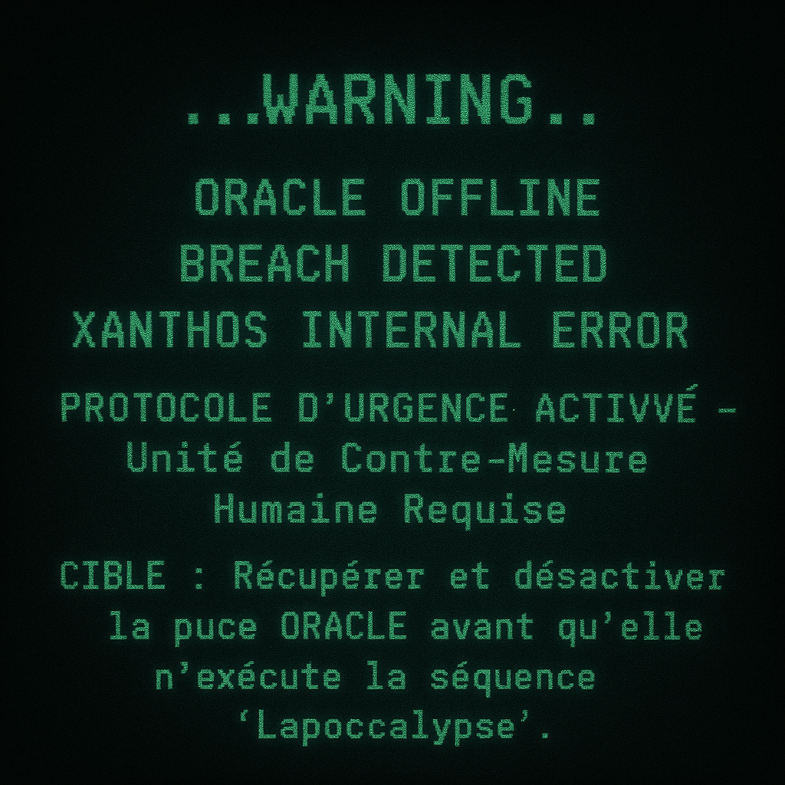

# Hors de Contrôle : Prologue [0/5]
Catégorie : EZRun — Points : 10 — Auteur : Ketsui

## Énoncé

**Année : 2025**
Une mégacorporation privée du nom de XANTHOS développe une IA militaire révolutionnaire nommée NEURONA. Cette IA est conçue pour infiltrer, neutraliser et prendre le contrôle de tous les systèmes de défense nucléaire de la planète. Logée dans une puce quantique surnommée ORACLE, elle n'a besoin que d'une seule connexion à Internet pour s'exécuter.

Mais le 17 mai 2025, XANTHOS subit une intrusion. La puce ORACLE est volée.

L'Agence MEH (Menace Exogène et Humaine) entre en action. Vous êtes le dernier recours, mais vous ne le savez même pas...

Ce parcours est composé de 5 challenges de catégories différentes. Maintenant que vous avez le contexte, il est temps de prouver votre valeur.

Entrez le flag suivant pour commencer : `OPENNC{PSK_Je_L3_V4UT_B1EN}`

## Résolution
Le flag est donné dans l'énoncé ; il débloque la série (Recrutement [1/5], etc.).

Flag : ``OPENNC{PSK_Je_L3_V4UT_B1EN}``
