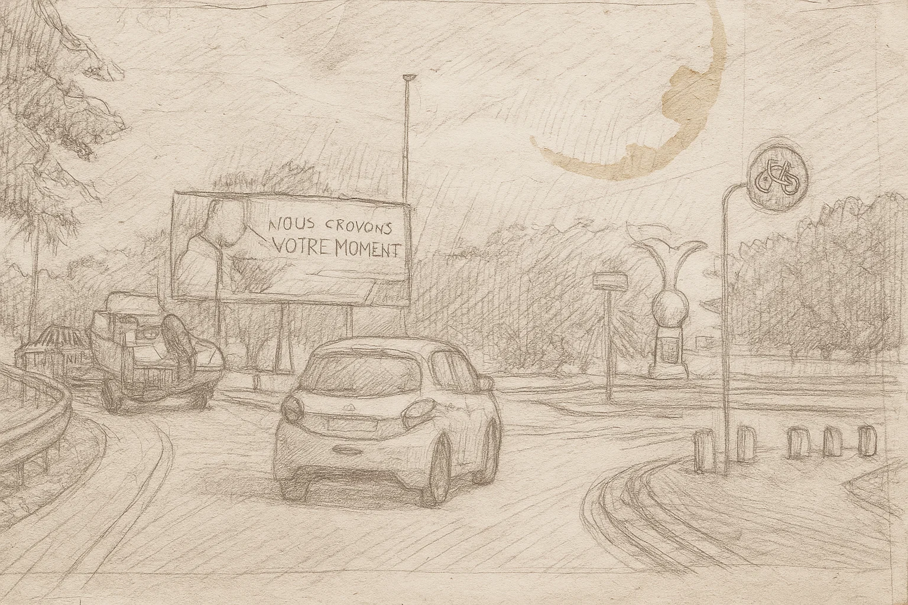
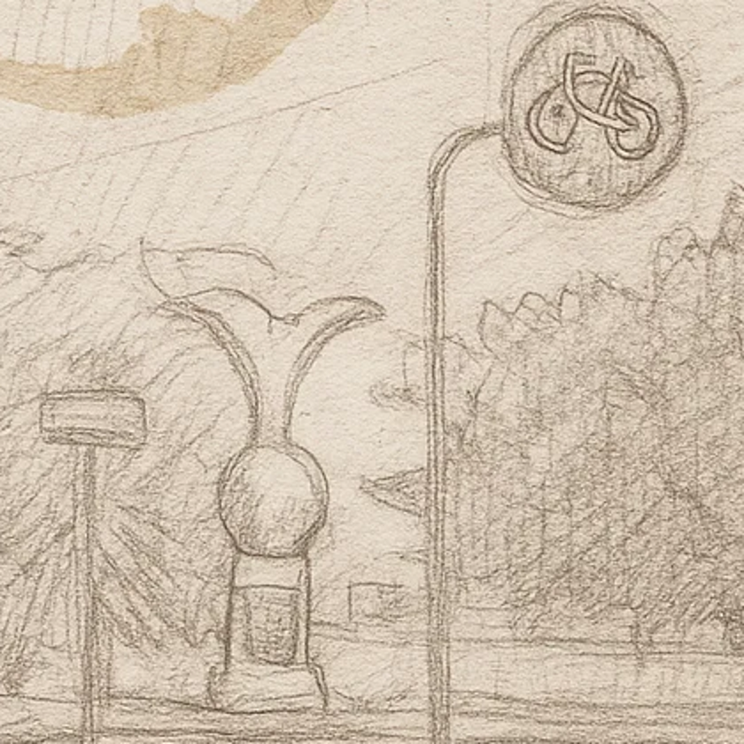

# Rassemblement (2025)
Catégorie : EZRun — Points : 10 — Auteur : Ketsui

## Énoncé
Le nord tombe peu à peu sous le joug de l'IA. Le sud ? Ce n'est plus qu'une question de mois.

Il est midi lorsque, sans avertissement, un obus transperce les nuages et explose en plein centre-ville.
La panique est immédiate. Les gens courent, crient, se bousculent.

Dans ce chaos assourdissant, tu es séparé de tes proches.

Les mesures anti-IA ont banni tout appareil connecté depuis plus de trois ans. Pas de téléphone. Pas de GPS. Rien.

Tu cherches. Encore et encore. Mais impossible de les retrouver.

Heureusement, ton pote avait tout prévu.
Il y a une semaine, Il avait remis à chacun un vieux croquis, griffonné à la main — un point de ralliement, en cas de catastrophe.

Tu te souviens de cette petite statue.
Autrefois, elle représentait l'aventure, les vacances en famille.
Aujourd'hui, elle ne signifie plus qu'une chose : la survie.

Voici ce croquis. Dis-nous dans quelle village il a été dessiné.

Format du Flag : `OPENNC{localite}`

Pièce jointe : [ledepart.webp](ledepart.webp)

## Résolution
Le croquis (pas de métadonnées exploitables dans le WebP) montre une route/rond-point, un panneau publicitaire, un véhicule tractant un bateau, un panneau rond « piste cyclable » et surtout, au fond, une **statue sur piédestal : un globe surmonté de deux ailes déployées** (zoom : [crop_statue.png](crop_statue.png)).

Indices de l'énoncé : « l'aventure, les vacances en famille » et le nom du fichier « le départ » → un aéroport et un exploit aérien.

En Nouvelle-Calédonie, le **monument du raid Paris–Nouméa 1932** (avion Couzinet 33 *Biarritz*, équipage de Verneilh, Dévé, Munch) a été érigé le 10 janvier 1937 à l'entrée de l'aérodrome de **La Tontouta** (commune de Païta). Wikipédia ([Raid Paris Nouméa 1932](https://fr.wikipedia.org/wiki/Raid_Paris_Noum%C3%A9a_1932)) le décrit ainsi : « il représente **deux ailes déployées au-dessus d'un globe** et une plaque de cuivre reproduisant les quatre continents traversés ». C'est exactement la statue du croquis (globe + ailes + plaque sur le socle).

- L'aventure = le raid aérien de 1932 ; les vacances en famille = les départs depuis l'aéroport international de La Tontouta.
- Le village = **Tontouta** (La Tontouta), village de la commune de Païta.

Flag : ``OPENNC{Tontouta}``
(variante si refusé : ``OPENNC{La Tontouta}`` / ``OPENNC{La_Tontouta}``)
