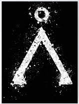
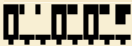

# Stargate (2025)
Catégorie : EZRun — Points : 10 — Auteur : k3rhu0n

## Énoncé


Ned : Pour échapper à NEURONA, cette dangereuse IA qui gagne du terrain, Tauira nous conseille de trouver un code pour la tromper...

Jocelyne : Mon père était un grand fan de la série Stargate. Je peux essayer de forger une clé à partir du langage des Anciens ?

Ned : Très bonne idée, tu en fabriques une et on demande à l'une des jeunes recrues du MEH de tester sa solidité !

Ta mission : essaie de déchiffrer ce code conçu par Jocelyne :



Le flag est de la forme : `OPENNC{Nombre}`

## Résolution
L'image `anciens.png` est le glyphe « point d'origine » de la Terre (Stargate) : il faut utiliser l'**alphabet des Anciens** (Alterans).
dCode propose cet alphabet, chiffres compris : <https://www.dcode.fr/ancients-stargate-alphabet>. Les glyphes y font 16 × 41 px :
une barre horizontale commune, un « pied » sous la barre, et au-dessus des blocs pleins/creux dont le motif code le chiffre
(ex. `0` = cadre creux, `1` = petit carré seul, `2` = bloc aux 2/3, `5` = bloc plein avec demi-colonne…).

`code.png` (132 × 46 px, agrandi : [code_x8.png](code_x8.png)) montre une barre de base continue avec **8 pieds espacés de 16 px** : 8 caractères collés.

Les glyphes chiffres ont été récupérés depuis dCode (`https://www.dcode.fr/tools/stargate-ancients/images/char(48..57).png`, copie dans `glyphs/`), puis comparés bloc par bloc (16 px) avec le script [stargate_decode.py](stargate_decode.py) :

```
$ uv run --with pillow python stargate_decode.py
bbox 3 4 130 44
0 (19, '0')
1 (2, '1')
2 (2, '1')
3 (19, '0')
4 (2, '2')
5 (19, '0')
6 (2, '2')
7 (2, '5')
Nombre : 01102025
```

`01102025` = 01/10/2025, la date du HacKagou 2025.

Flag : ``OPENNC{01102025}``
