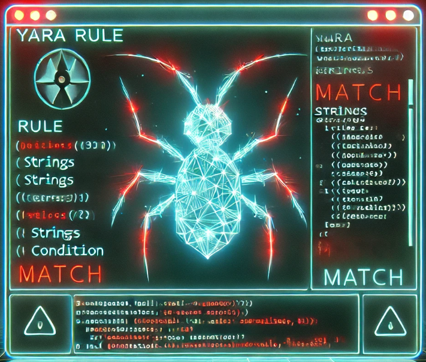

# YARA
Catégorie : Enquête — Points : 100 — Auteur : k3rhu0n

## Énoncé
Ned : Tauira a relevé d'autres traces et a pu exporter un fichier [MISP](https://www.circl.lu/doc/misp/). Je pense qu'on tient un truc, quelque chose que NEURONA essaierait de rejouer pour piéger nos machines !

Jocelyne : Oh quelle bonne nouvelle !

Ned : Alors oui, mais pour que les résultats soient exploitables, trouve-moi la règle [YARA](https://www.sekoia.io/fr/glossaire/regle-yara/) qui a matché et l'IP contactée.

Jocelyne : Sorry, là j'ai pas le temps. Je demande à un des volontaires du MEH.



Ta mission : Aide Jocelyne à trouver les éléments cherchés.

Le flag est de la forme : `OPENNC{Nom_règle_YARA,IP}`

Pièce jointe : [misp.json](misp.json)

## Résolution
L'export MISP est minuscule, il contient :

```json
"info": "Report for \"215285fb7f1687aa20a5ea5333392bf2573df0f089b964a48a2b78f562d6a171\" (generated from HacKagou2025 service)",
"Attribute": [{"type": "link",
  "value": "https://hybrid-analysis.com/search?query=215285fb7f1687aa20a5ea5333392bf2573df0f089b964a48a2b78f562d6a171",
  "comment": "Focus on May 31st 2024 results !"}],
"Tag": [ "hackagou:classification=\"metastealer\"", "hackagou:classification=\"netreactor\"" ]
```

On ouvre la fiche Hybrid Analysis du SHA-256 (le site est une SPA, il faut un navigateur) :
`https://hybrid-analysis.com/sample/215285fb7f1687aa20a5ea5333392bf2573df0f089b964a48a2b78f562d6a171`

- Fichier `5ece0d23…_payload.exe`, .NET, famille RedLine/MetaStealer (cohérent avec les tags MISP).
- Deux rapports sandbox, tous deux datés du **31/05/2024** :
  - R1, Windows 10 64 bits (`/665a5e5fd34b137e5e07f139`)
  - R2, Windows 7 64 bits (`/665a5dcf61bcd287ab0e9148`)

Dans *Malicious Indicators → Pattern Matching → YARA signature match → Details* :

- R2 : `YARA signature "MALWARE_Win_zgRAT" matched file "sample.bin" as "Detects zgRAT" (Author: ditekSHen)`
- R1 : la même règle `MALWARE_Win_zgRAT` sur `sample.bin`, plus `mimikatz_lsass_mdmp`, qui matche un dump mémoire de processus et non l'échantillon.

La seule règle qui matche le fichier dans les deux rapports est `MALWARE_Win_zgRAT`.

Dans *Network Analysis → Contacted Hosts* (identique dans les deux rapports) :

| IP | Port | Pays |
|---|---|---|
| 5.42.65.67 | 48396/TCP | Russie |

Les alertes Suricata confirment le C2 : `ET MALWARE [ANY.RUN] RedLine Stealer/MetaStealer Family Related (MC-NMF Authorization)` vers 5.42.65.67:48396.

Flag : ``OPENNC{MALWARE_Win_zgRAT,5.42.65.67}``
