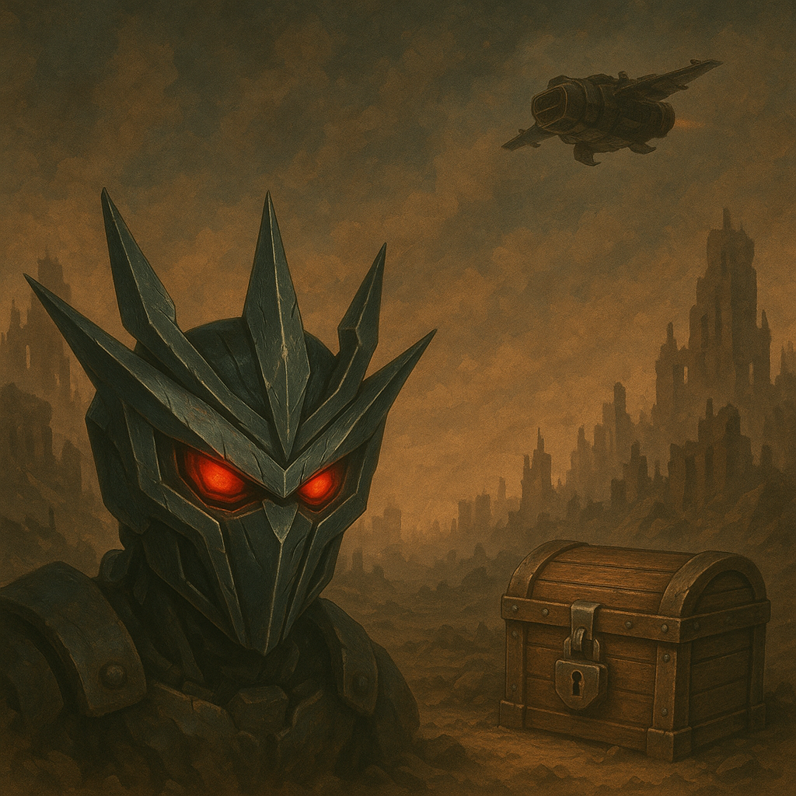
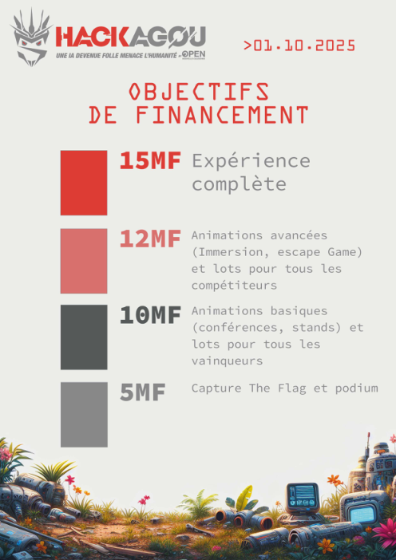

# Chasse au trésor ? (2025)
Catégorie : Éphémère — Points : 10 — Auteur : \0/

## Énoncé
Pour cette édition 2025, les organisateurs du HacKagou ont imaginé tout un tas d'activités et d'animations, ainsi que divers éléments de décors pour faire du HacKagou un évènement agréable et festif.
Mais pour prendre forme, tout ceci nécessite des moyens importants et un budget en plusieurs tranches a été préparé.

Sauras-tu retrouver le montant de la tranche qui permettra de proposer une "Expérience complète" ?



Format du flag : `OPENNC{Montant de la tranche en francs}`
Par exemple, si le montant est de 1,2MF (1,2 millions de francs), alors le flag est OPENNC{1200000}

## Résolution
L'image ne contient rien d'utile (simple image générée, manifeste C2PA « GPT-4o / OpenAI API »). Le trésor est le **dossier de partenariat** du HacKagou 2025.

1. La page `https://www.hackagou.nc/edition2025.html` de l'époque (Wayback Machine, capture du 10/07/2025) contient un lien vers
   `https://www.open.nc/wp-content/uploads/2025/04/DOSSIER-HACKAGOU-20250402.pdf` :
   ```
   curl -s "https://web.archive.org/web/20250710211331id_/https://www.hackagou.nc/edition2025.html" | grep -o 'https://www.open.nc/[^"]*pdf'
   ```
2. Le PDF (11 pages, uniquement des images) : la page 9 « OBJECTIFS DE FINANCEMENT » liste les tranches :

   | Tranche | Contenu |
   |---|---|
   | **15MF** | **Expérience complète** |
   | 12MF | Animations avancées (Immersion, escape game) et lots pour tous les compétiteurs |
   | 10MF | Animations basiques (conférences, stands) et lots pour tous les vainqueurs |
   | 5MF | Capture The Flag et podium |

   

15 MF = 15 000 000 F CFP.

Flag : ``OPENNC{15000000}``
