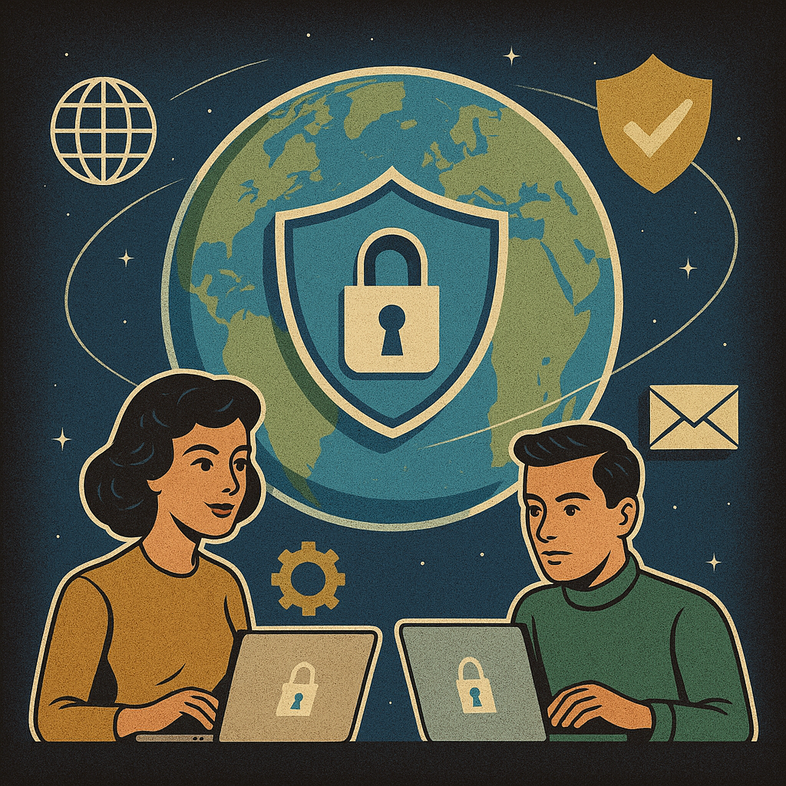

# Cyber moi, cyber toi (2025)
Catégorie : Éphémère — Points : 10 — Auteur : \0/

## Énoncé

La cybersécurité est un enjeu global et un défi collectif.

Chaque année, dans de plus en plus de pays, le mois d'octobre est consacré à la cybersécurité et le HacKagou est un des évènements qui ouvre cette période pendant laquelle un effort particulier est fait pour informer, sensibiliser et promouvoir les bons réflexes de cybersécurité (mots de passe robustes, MFA, mises à jour, vigilance face au phishing, etc.)

Quel pays a été le premier à lancer le mois de la cybersécurité, et de quand date cette initiative ?

Format du flag : `OPENNC{Pays_MMAAAA}`
Par exemple, si c'est une initiative de l'Australie depuis janvier 2025, alors le flag est OPENNC{Australie_012025}

## Résolution
Question de culture générale. Le « Cybersecurity Awareness Month » (ex-*National Cyber Security Awareness Month*, NCSAM)
a été lancé aux **États-Unis** en **octobre 2004** par le Department of Homeland Security (DHS) et la National Cyber
Security Alliance (NCSA). L'Union européenne n'a suivi qu'en 2012 (European Cyber Security Month, ECSM, piloté par l'ENISA),
et la France s'y associe via Cybermalveillance.gouv.fr.

Sources : page CISA *Cybersecurity Awareness Month* (octobre est le mois de la cybersécurité aux États-Unis depuis 2004) ;
staysafeonline.org (NCSA).

Mois/année : octobre 2004 → `102004`.

Flag : ``OPENNC{Etats-Unis_102004}``

