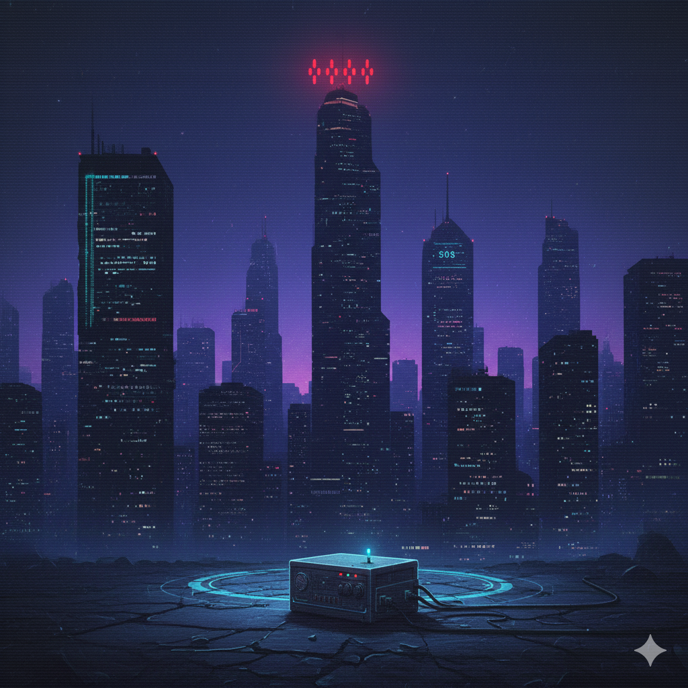

# À longueurs d'ondes [1/3] (2025)
Catégorie : OSINT — Points : 100 — Auteur : GiGaWATT988

## Énoncé

Les réseaux de communications numériques sont tous tombés.

Nous devons nous tourner vers des technologies "low-tech" pour communiquer entre nous, en boucle fermée, sans possibilité de prise en main par NEURONA.
Les réseaux radio "analogique" ont repris de l'importance. NEURONA ne peut pas contrôler ces équipements, mais peut nous écouter. Nos communications utilisent des codages des anciens temps.

Dans un premier temps, la MEH nous demande de retrouver un type de codage de l'ancien monde.
La seule piste que nous avons est ce symbole étrange "FK8KAB", évoqué semble-t-il par un journal local ... de quoi peut-il bien s'agir ?

Format du Flag : `OPENNC{..........}`

## Résolution
1. `FK8KAB` est un **indicatif radioamateur** (préfixe FK = Nouvelle-Calédonie) : c'est l'ancien indicatif du radio-club de l'ARANC (Association des Radioamateurs de Nouvelle-Calédonie), aujourd'hui FK8KA (cf. <http://www.corail.nc/FK8KAB/>).
2. « Journal local » → *Les Nouvelles Calédoniennes*. Recherche `"FK8KAB" lnc.nc` → article du 20/05/2011 : **« Sauver la planète Morse »**
   <https://www.lnc.nc/article/societe/sauver-la-planete-morse>
   > « A l'Association des radioamateurs de Nouvelle-Calédonie, baptisée FK8KAB, le doyen a 84 ans et le petit dernier 41 ans. […] »
   > « Si un jour, il y a une guerre des étoiles et que les satellites sont par terre, nous, les dinosaures, on sera toujours là pour trafiquer et on pourra communiquer avec un bout de fil et un émetteur »
3. Le codage de l'ancien monde est donc le **code Morse** (l'image de l'énoncé affiche d'ailleurs « SOS » sur une tour).
   Le format impose 10 caractères : `code morse` / `code_morse` / `morse_code` font tous 10 caractères.

Flag : ``OPENNC{code_morse}``
