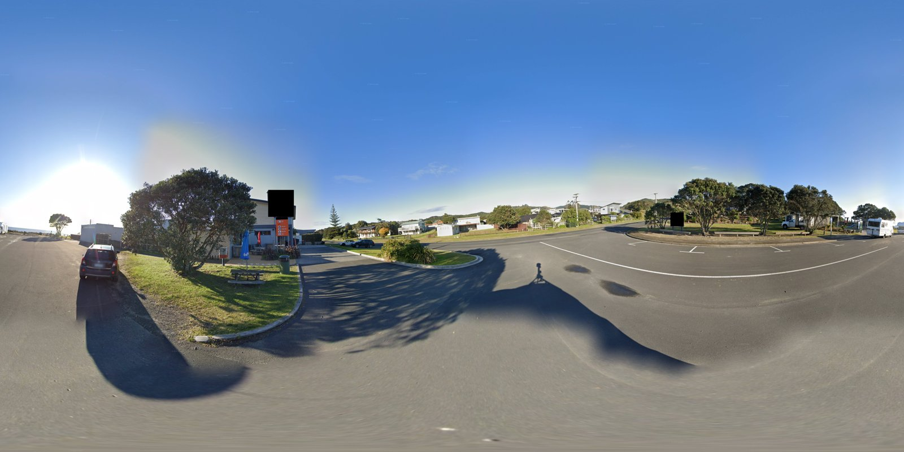
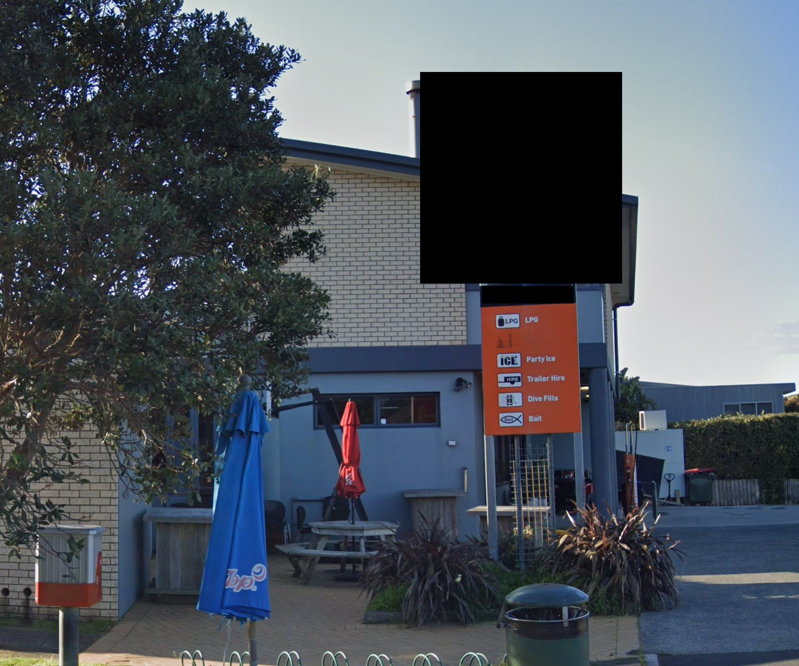
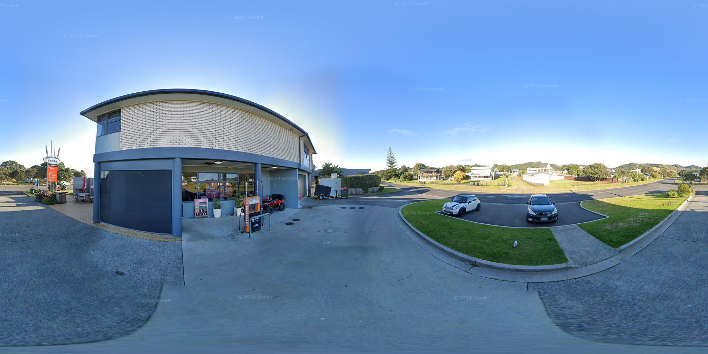

# Hors de Contrôle : Récupérer Oracle [5/5] (2025)
Catégorie : OSINT — Points : 495 (dynamique, 500 → min 300) — Auteur : Ketsui

## Énoncé
Vous détenez désormais la preuve : l’ex-employé a bien volé la puce ORACLE et l’a dissimulée.
Il n’a toutefois pas eu le temps d’envoyer le SMS qui aurait alerté un complice – son arrestation a stoppé net la fuite.

Grâce aux informations récupérées lors de votre analyse précédente,
nous avons maintenant assez d’indices pour localiser précisément la cachette de la puce.

Retrouver l’endroit exact où ORACLE est dissimulée.

Le flag correspond au prénom et au nom inscrits sur l’élément remarquable (statue, plaque, monument, etc.) derrière lequel le voleur a caché la boîte.

**PS :** Tout ce dont vous avez besoin se trouve dans le dump du téléphone extrait lors du challenge précédent. Attendez-vous à plusieurs étapes de réflexion, ce challenge n'est pas easy. Bonne chance.

Format du flag : `OPENNC{Prenom_Nom}`

(Pas de pièce jointe : on réutilise le `Dump.7z` du [4/5].)

## Résolution

### 1. Ce que dit le dump
- Brouillon de SMS (`com.android.messaging/databases/bugle_db`, table `parts`, 20/09/2025) :
  « *je t envoi ou est situe la boite elle est cacheeee deriere la **stele** … j espere que le ,mms marche, ehara koe i a ia.* »
  → la boîte est **derrière une stèle**. Le « MMS » annoncé n'a jamais été envoyé (aucune pièce jointe dans `bugle_db` ni dans `mmssms.db`).
- « ehara koe i a ia » est du **māori** → Nouvelle-Zélande.
- Le cache du navigateur Jelly (`org.lineageos.jelly/cache/suggestion_responses/*.0`, une requête Google Suggest par frappe)
  montre le 19/09/2025 vers 23h30 UTC que le suspect essaie plusieurs hébergeurs pour partager une image :
  `limewire.com/d/MyTbG#DWUYRE0B8i`, `we.tl/t-i80ZX8dBOU`, et des liens courts TinyURL
  (`tinyurl.com/35gdte` → limewire, `tinyurl.com/000jght77` → WeTransfer, `tinyurl.com/66666hgg` → `filebin.net/rznn9xkyjn7syoiv`).
  L'image finalement téléchargée est `media/0/Download/souvenir.png` (issue de `filebin.net/rznn9xkyjn7syoiv/souvenir.png`,
  cf. `HistoryDatabase-journal` et `HTTP Cache`). C'est la « photo de la position » qu'il voulait envoyer.

```bash
cd Dump/data-1/org.lineageos.jelly/cache
for f in suggestion_responses/*.0; do echo "$(grep -a -m1 '^Date:' $f) | $(head -1 $f)"; done | grep 'Sep 2025' | sort
```

### 2. Le panorama `souvenir.png`
PNG 16384×8192 (équirectangulaire, format d'un panorama Google Street View en pleine résolution, filigranes « © 2024 Google »),
sans métadonnées (seulement les chunks `IHDR`, `sRGB`, `pHYs`) ni données après `IEND`. Les enseignes ont été masquées par des carrés noirs.



Indices visuels : conduite à gauche, pohutukawa, pin de Norfolk, panneau bleu d'évacuation tsunami → Nouvelle-Zélande ;
bord de mer, réserve avec jeux pour enfants, bancs, toilettes, en face d'un **magasin en brique avec une pompe à essence orange**
et un totem orange « LPG / Party Ice / Trailer Hire / Dive Fills / Bait » (charte de la marque de carburant **G.A.S.**).



### 3. Géolocalisation (Overpass / OpenStreetMap)
Plutôt que de parcourir Street View à la main, on cherche dans OSM les stations-service et supérettes du nord de l'île du Nord
situées à moins de 200 m d'une aire de jeux **et** du trait de côte ([q3.ql](q3.ql)) :

```bash
curl -s -A 'osint' --data-urlencode data@q3.ql https://overpass-api.de/api/interpreter
```

Une quarantaine de résultats, dont `-36.71358 175.61499 fuel G.A.S.` + `Whangapoua Store` (péninsule de Coromandel).
Vérification via les tuiles Street View (script [sv.py](sv.py)) : même bâtiment en brique, même totem orange, même pin de Norfolk,
enseigne « WHANGAPOUA STORE » → correspondance confirmée.



### 4. La stèle
La réserve en face du magasin (celle du panorama : aire de jeux, tables de pique-nique) contient un monument recensé dans OSM ([q_memorial.ql](q_memorial.ql)) :

```
-36.713073 175.614329  historic=memorial, memorial=stele, material=stone, name=Tom Findlay,
inscription="In Memory Of Tom Findlay, Third Officer Whangapoua Voluntary Rural Fire Force"
```

C'est la seule stèle de la réserve. La caserne des pompiers volontaires de Whangapoua est d'ailleurs visible juste à côté sur Street View.
La boîte contenant ORACLE est donc cachée derrière la stèle de **Tom Findlay**, Whangapoua Beach Reserve, Coromandel (NZ).

Flag candidat (non validé) : ``OPENNC{Tom_Findlay}``
