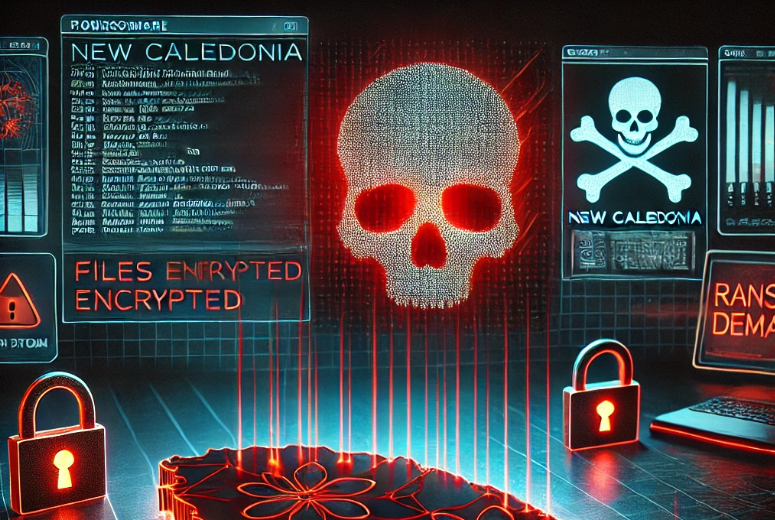

# Ransomware
Catégorie : OSINT — Points : 100 — Auteur : k3rhu0n

## Énoncé
Ned : Cette fois on est mal barrés, NEURONA est en train de déployer un ransomware. Tauira a pu capturer un sample du malware, voici le hash :
`3c92bfc71004340ebc00146ced294bc94f49f6a5e212016ac05e7d10fcb3312c`

Jocelyne : Oui j'ai aussi eu l'info, le MEH est en train de chercher à reconstruire leurs données, ils ont testé plusieurs outils mais seul l'un d'eux fonctionne. Mais les communications sont coupées, je ne peux plus leur parler. Il faut qu'on cherche partout où ils l'ont exécuté sur les réseaux distants, afin de l'identifier pour ensuite le préparer chez nous. Je vais écrire une règle de corrélation pour parser les logs, mais j'ai besoin du hash de l'outil pour cela...

Ned : Y'a pas de jeunes volontaires du MEH dans ton équipe ?

Jocelyne : Oui OK je leur demande !



Ta mission : Aide Jocelyne à retrouver l'outil de déchiffrement !

Le flag est de la forme : `OPENNC{hash}`

Indice gratuit : « Ce challenge a été proposé aux joueurs le 1er octobre 2025 ». Il existe aussi un indice payant à 30 pts, non débloqué.

## Résolution

### 1. Identifier le ransomware
Sur Hybrid Analysis ou VirusTotal, le SHA-256 donne **Akira ransomware** (Trojan.Ransom.Akira), version Windows x64, vue pour la première fois en avril 2023. Il figure dans les IOC de l'article d'Avast/Gen Digital « Decrypted: Akira Ransomware » (29/06/2023). Avast y publie un déchiffreur gratuit en deux variantes :

- 64 bits : `avast_decryptor_akira64.exe`, la version recommandée par Avast (le cassage du mot de passe consomme beaucoup de mémoire)
- 32 bits : `avast_decryptor_akira.exe`

Sur No More Ransom (*Decryption Tools → Akira Ransom*), un seul outil est proposé, et le lien pointe uniquement vers la version **64 bits** : `https://files.avast.com/files/decryptor/avast_decryptor_akira64.exe`, qui redirige vers `https://s-decryptors.avcdn.net/decryptors/avast_decryptor_akira64.exe`.

### 2. Retrouver l'outil tel qu'il était le 1er octobre 2025
Le binaire a été mis à jour plusieurs fois, et le lien renvoie aujourd'hui une 404. L'indice sur la date sert à retrouver la version publiée au moment du challenge. On liste les captures de la Wayback Machine (CDX) et on télécharge les binaires avec `id_`, sans jamais les exécuter :

```
curl "https://web.archive.org/cdx/search/cdx?url=s-decryptors.avcdn.net/decryptors/avast_decryptor_akira64.exe&output=json"
curl -o a.exe "https://web.archive.org/web/<ts>id_/https://s-decryptors.avcdn.net/decryptors/avast_decryptor_akira64.exe"
```

| Capture | Arch | Version PE | SHA-256 |
|---|---|---|---|
| 2023-07-04 | x64 | 1.0.0.651 | 9e9d89d90beaefb56913b31e1a04e0bfb60c1b800267d0f25f9619d9eb2c3eac |
| 2023-07-04 | x86 | 1.0.0.651 | b40d3cdf4c97b5107864b022623ce710244189ad60f5bb5cf182574c0c69a910 |
| **2025-08-21** | **x64** | **1.0.0.777** (compilée le 23/07/2025) | **eb72d360a5d95006690cc1192909a0fe12b817e9912c172c8a9b2788ea060844** |
| 2025-08-21 | x86 | 1.0.0.777 | d23ce9bfc8cff85f2ce422bb89e40b3d5cff0d6811fbfef0d66df617a4adbdbb |
| 2025-12-28 | x64 | 1.0.0.815 | 5aebea49cf9fdfe060ae2d1e000a567f88ddaac3ea8b8237fef733f71a00a875 |
| 2026-02-08 | x64 | 1.0.0.816 | 15d7f6c4d8f0f86bbbb52383c7b0ac62c2c9938424ce2f9f13751c56e5723a46 |

La version en ligne au 1er octobre 2025 est la 1.0.0.777. Sur VirusTotal, le binaire x64 de cette version (`eb72d360…`) a été vu entre le 24/07 et le 15/08/2025, et exécuté dans plusieurs sandboxes : CAPE, Zenbox, Jujubox, Sysinternals. C'est ce qui correspond à « là où ils l'ont exécuté sur les réseaux distants ». Le binaire x86 de la même version n'a été soumis qu'une fois, avec une analyse statique CAPA seulement.

Flag : ``OPENNC{eb72d360a5d95006690cc1192909a0fe12b817e9912c172c8a9b2788ea060844}``

Autres candidats si refusé, du plus au moins probable :
- 64 bits d'origine (2023) : `OPENNC{9e9d89d90beaefb56913b31e1a04e0bfb60c1b800267d0f25f9619d9eb2c3eac}`
- 32 bits 1.0.0.777 : `OPENNC{d23ce9bfc8cff85f2ce422bb89e40b3d5cff0d6811fbfef0d66df617a4adbdbb}`
- 32 bits d'origine : `OPENNC{b40d3cdf4c97b5107864b022623ce710244189ad60f5bb5cf182574c0c69a910}`

Doute restant : il n'est pas certain que l'organisateur attende la version d'octobre 2025. Il peut aussi s'agir du binaire d'origine de 2023, le plus soumis et le plus exécuté en sandbox (13 soumissions sur VirusTotal). L'indice payant permettrait sans doute de trancher.
