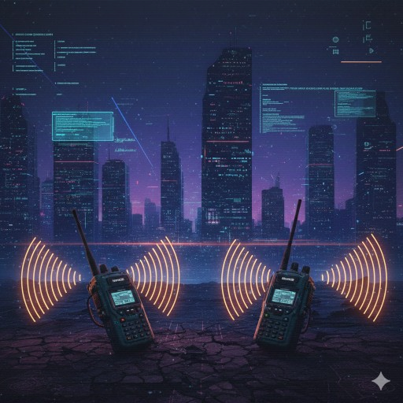

# À longueurs d'ondes [2/3] (2025)
Catégorie : Stégano — Points : 250 (dynamique) — Auteur : GiGaWATT988

## Énoncé


Maintenant ce code identifié, un second fichier nous a été laissé à Ned et moi, afin de mieux comprendre ce que nous devons écouter.
Que cache cette étrange image ... ?

Format du Flag : `OPENNC{l'information trouvée}`

## Résolution
Le [1/3] a identifié le « code » : le morse. L'image (PNG 512×512 RGBA, canal alpha constant à 255) ne contient
rien d'intéressant dans ses métadonnées ni dans ses `strings`. On teste une extraction LSB classique
(bit 0 des canaux R, G, B, pixel par pixel, ligne par ligne, MSB d'abord — équivalent de `zsteg -a` `b1,rgb,lsb,xy`) :

```python
from PIL import Image; import numpy as np, re
im = np.array(Image.open('Steg-CTF.png').convert('RGB'))
b = np.packbits((im & 1).reshape(-1)).tobytes()
print(re.match(rb'[ -~]+', b).group().decode())
```
(script complet avec décodeur morse : `solve.py`, lancer avec `uv run --with pillow --with numpy python solve.py`)

Sortie (69 caractères, puis que des octets nuls) :
```
....- ....- -.... --..-- .---- ----- -.... ..--- ..... / -- .... --..
```
Décodage morse : `4 4 6 , 1 0 6 2 5 / M H Z` → **446,10625 MHz**.

C'est la fréquence du canal 8 de la bande PMR446 (talkies-walkies grand public, cohérent avec les deux talkies
de l'image) : c'est « ce que nous devons écouter ».


### Réexamen (vague 3)
- **Bits cachés** : seul le plan 0 de R, G et B est modifié. Il contient les 69 octets du morse, suivis de zéros sur toute l'image (proportion de bits à 1 : 0,0003 au total, 0 après les 2 premières lignes). Les plans 1 à 3 sont naturels (≈ 0,50 de bits à 1). L'alpha vaut 255 partout. Un balayage complet (plans 0 à 7, canaux R/G/B/A/RGB/RGBA/BGR, ordres ligne et colonne, bits MSB et LSB d'abord, script [lsb_scan.py](lsb_scan.py)) ne sort aucune autre chaîne.
- **Fichier** : chunks IHDR/sRGB/IDAT×47/IEND uniquement, sans texte (tEXt/iTXt), ni exif, ni données après IEND. Le filigrane Gemini en bas à droite indique une image générée par IA.
- **Morse** : chaque symbole est non ambigu. `....-`=4, `....-`=4, `-....`=6, `--..--`=**virgule**, `.----`=1, `-----`=0, `-....`=6, `..---`=2, `.....`=5, `/`=séparateur de mots, `--`=M, `....`=H, `--..`=Z. On obtient « 446,10625 MHZ ». Le morse n'a pas de casse : « MHZ » en majuscules est un artefact de décodage.

L'information est donc certaine. Seul le format du flag est en cause. Candidats, par ordre de probabilité (non validés) :
1. `OPENNC{446,10625 MHz}` : unité écrite correctement (SI), si la comparaison CTFd est sensible à la casse.
2. `OPENNC{446,10625}` : fréquence seule, le `/` séparant la valeur de l'unité.
3. `OPENNC{446.10625MHz}` (ou `446.10625 MHz`) : point décimal anglo-saxon.

Le flag attend la fréquence telle que décodée, avec l'unité écrite correctement « MHz » (le morse n'a pas de casse ; refusés : `446,10625 MHZ`, `446,10625MHZ`).

Flag : ``OPENNC{446,10625 MHz}``
