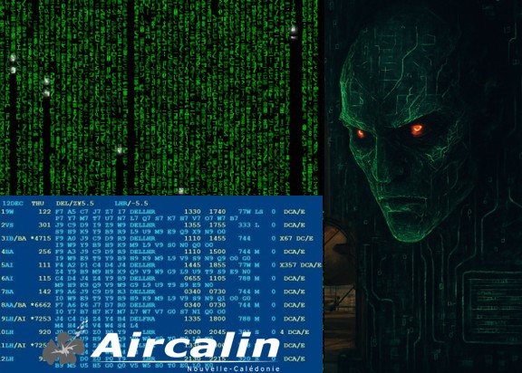
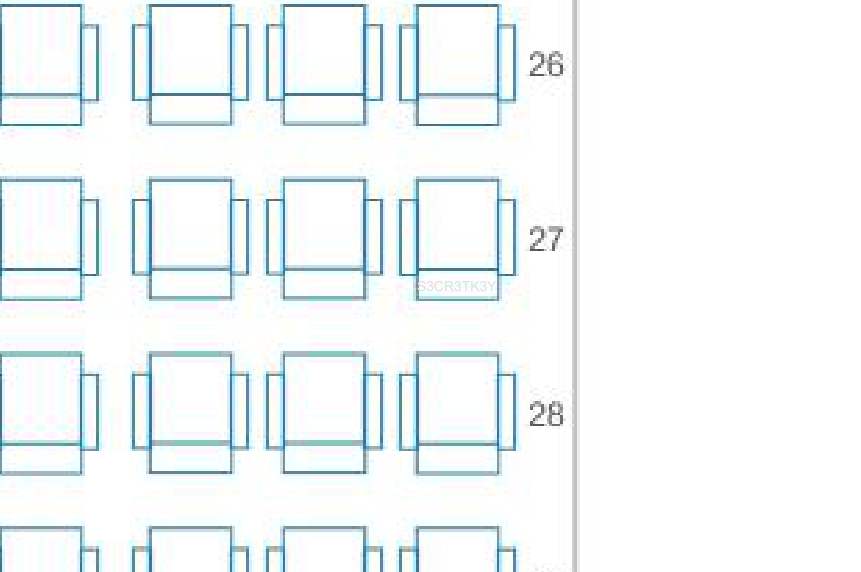

# Passenger Name Record (PNR)
Catégorie : Stégano — Points : 250 (dynamique, min 150) — Auteur : k3rhu0n

## Énoncé
Ned : Hey Jocelyne, la MEH pense que Tauira a des infos cruciales sur la puce Oracle. Ce que j'en comprends, c'est que si on découvre des failles sur cette puce, on pourrait les exploiter pour ralentir NEURONA. Tauira doit d'abord nous rejoindre, mais NEURONA va chercher à savoir où il est et à l'intercepter en fouillant dans les données de réservation.



Jocelyne : C'est trop net si Tauira nous rejoint, mais on doit empêcher NEURONA de mettre la main sur ses données de voyage. Si elle trouve son PNR avant nous, elle va prendre l'avantage.

Ned : Connaissant Tauira, il va nous laisser un indice pas loin de son siège dans l'avion, c'est très important car il y a certainement un élément important sur la puce. Jocelyne, peux-tu brouiller les pistes pour tromper NEURONA ?

Jocelyne : OK Ned, hors de question qu'elle localise Tauira et l'indice secret !

Le flag est de la forme : `OPENNC{xxxx}`

Fichiers : [coffre-fort.txt](coffre-fort.txt), [images.zip](images.zip)

## Résolution
### 1. Le coffre-fort
`coffre-fort.txt` contient un lien de partage Proton Drive :

```
https://drive.proton.me/urls/5W0N5MXJRW#zL3x1yAdaA7J
```

À l'ouverture, Proton Drive affiche « This link is password protected » : il faut un mot de passe supplémentaire.

### 2. Les cartes d'embarquement
`images.zip` contient 12 captures (01.jpg … 12.jpg) du site Aircalin. Chaque JPEG porte, dans son segment commentaire (`COM`, visible avec `strings` ou `exiftool`), une carte d'embarquement du vol SB141 du 01-OCT-25 :

```
01.jpg WAMYTAN Mauricette | PNR N8H3ZQ | ... Siège 17E
...
09.jpg FENUA Tauira | PNR K2D3PL | SB141 01-OCT-25 | Classe Y Siège 27F | Gate 32 | Boarding 10:25
...
```

Le passager qui nous intéresse est **FENUA Tauira** : PNR **K2D3PL**, siège **27F**.

### 3. Ouverture du partage
Le PNR `K2D3PL` est le mot de passe du lien Proton Drive. Il donne accès à `plan-cabine-a320neo.pdf` ([copie](plan-cabine-a320neo.pdf)), un plan de cabine d'A320neo (une image JPEG pleine page).

Une couche texte en gris très clair (`0.878 0.878 0.878 rg`, police 5 pt) est ajoutée par-dessus l'image, **juste sous le siège 27F** :

```bash
uv run --with pymupdf python solve.py
# ...
# S3CR3TK3Y
```



C'est l'« indice laissé pas loin de son siège ».

> Pistes vérifiées sans résultat : `steghide` (passphrases S3CR3TK3Y, K2D3PL, vide, 27F) sur les 12 JPEG, sur l'image d'énoncé et sur l'image extraite du PDF : aucune donnée cachée. Rien non plus après les marqueurs EOI des JPEG. Le texte caché semble donc être le flag lui-même.

Flag : ``OPENNC{S3CR3TK3Y}``
