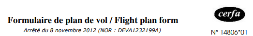

# Plan de vol
Catégorie : Stégano — Points : 250 (dynamique, min 150) — Auteur : k3rhu0n

## Énoncé
Ned : NEURONA a effacé toute trace numérique d'un vol Aircalin spécial, qui transporte du matériel médical vital. Elle a masqué le plan de vol !

Jocelyne : mais qu'est-ce que ça veut dire ?

Ned : Sans plan de vol, le vol Aircalin sera vu comme suspect et NEURONA risque d'envoyer des drones de chasse. Il faut à tout prix récupérer des éléments du plan de vol initial pour en redéposer un !
Tauira m'a dit qu'il avait eu le temps d'effectuer une capture réseau depuis une machine de XANTHOS, qu'il a réussi à compromettre. Les données y sont peut-être, cachées par NEURONA...

Jocelyne : Tu veux que j'essaie de retrouver ces données ?

Ned : Oui, il nous faut au moins le numéro de vol spécial et le nom de l'aéroport de destination.

Jocelyne : OK, je m'y mets tout de suite !



Ta mission : Aider Jocelyne !

Le flag est de la forme : `OPENNC{NuméroVol_NomAéroport}`

Fichier : [HK2025_pdv.pcap](HK2025_pdv.pcap)

## Résolution
La capture ne contient que du TCP : 165 connexions HTTP courtes de `192.168.0.222` (ports source 40000, 40001, …) vers `203.0.113.10:80`, chacune avec une seule requête `GET /` vers `Host: aviation-civile.gouv.fr`.

Les requêtes sont identiques, sauf le `User-Agent`, qui est un gabarit Firefox (`Mozilla/5.0 (platform; rv:gecko-version) Gecko/gecko-trail Firefox/firefox-version`) dans lequel **un caractère différent est inséré juste avant `Gecko/`** :

```
User-Agent: Mozilla/5.0 (platform; rv:gecko-version)  AGecko/...
User-Agent: Mozilla/5.0 (platform; rv:gecko-version)  iGecko/...
User-Agent: Mozilla/5.0 (platform; rv:gecko-version)  rGecko/...
...
```

Il suffit de concaténer ces caractères dans l'ordre des connexions ([solve_pdv.py](solve_pdv.py)) :

```bash
uv run --with scapy python solve_pdv.py
```

```
Aircalin,SB421,01-OCT-2025,Nouma (La Tontouta),NWWW,Port-Vila (Bauerfield),NVVV,09:30,10:55,01:25,A320neo,"NWWW DCT ATMAP DCT PIKON DCT NVVV",138,"2P/4PNC",32,09:00
```

C'est une ligne CSV de plan de vol (le « é » de Nouméa, non ASCII, est perdu par l'expression régulière) :

| Champ | Valeur |
|---|---|
| Compagnie | Aircalin |
| N° de vol | **SB421** |
| Date | 01-OCT-2025 |
| Départ | Nouméa La Tontouta (NWWW) |
| Destination | **Port-Vila (Bauerfield)** (NVVV) |
| Horaires | 09:30 → 10:55 (01:25) |
| Appareil | A320neo |
| Route | NWWW DCT ATMAP DCT PIKON DCT NVVV |

Vol spécial **SB421**, aéroport de destination **Bauerfield** (Port-Vila, Vanuatu).

Flag : ``OPENNC{SB421_Bauerfield}``

