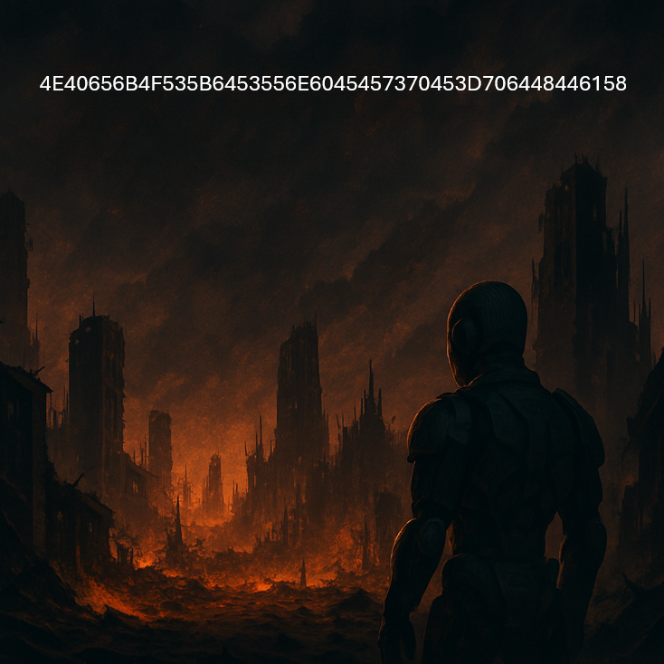

# La menace se précise... (MidHack 2025)

Catégorie : Crypto — Points : 100 — Auteur : HacKagou / MidHack

## Énoncé

Mais où se cache-t-elle ? Cette menace. Un programme ?

Visiblement, des temps sombres sont annoncés…
Il n'est peut-être pas encore trop tard avant que l'inéluctable se produise.

Nous devons trouver un emplacement où nous pourrons encore traquer ce programme qui semble prendre de l'ampleur minute après minute, avant ce qui est annoncé…

Nous avons une date, celle du **1er octobre 2025**. C'est peut-être la clé de tout cela.

Localisons vite ce programme !



Le flag est de la forme : `OPENNC{xxxxxx}`

## Résolution

L'image affiche une chaîne hexadécimale :

```
4E40656B4F535B6453556E6045457370453D706448446158
```

Soit 24 octets. Le décodage ASCII direct ne donne rien de lisible : la donnée est chiffrée.

L'énoncé insiste sur une **date, le 1er octobre 2025**, présentée comme « la clé ».
En interprétant la date `01/10/20/25` comme quatre octets (`0x01 0x10 0x20 0x25`),
on obtient une clé de XOR répétée de longueur 4.

Vérification : on sait que le flag commence par `OPENNC{` (octets `4F 50 45 4E 4E 43 7B`).
En XORant le début du chiffré avec ce préfixe attendu, on retrouve exactement le motif
répété `01 10 20 25`, ce qui confirme la clé.

```python
enc = bytes.fromhex("4E40656B4F535B6453556E6045457370453D706448446158")
key = bytes([0x01, 0x10, 0x20, 0x25])   # date 01/10/2025
out = bytes([enc[i] ^ key[i % 4] for i in range(len(enc))])
print(out.decode())
# OPENNC{ARENEDUSUD-PAITA}
```

Le résultat désigne un lieu réel de Nouvelle-Calédonie : l'**Arène du Sud à Païta**,
cohérent avec la consigne « localisons vite ce programme ».

Flag : ``OPENNC{ARENEDUSUD-PAITA}``
