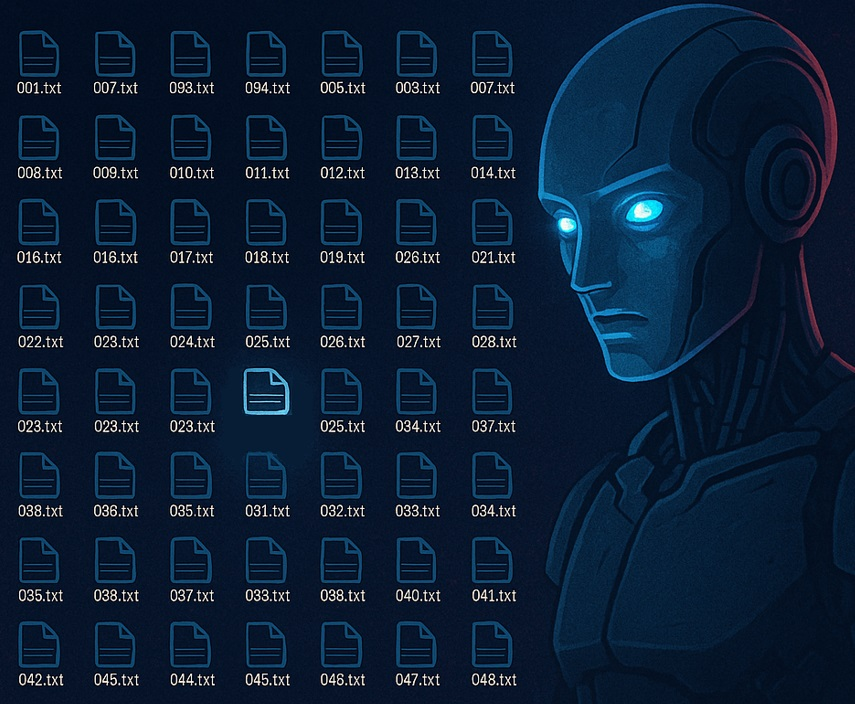

# Quelque chose de bizarre...

Catégorie : Stégano (tag : Scripting) — Points : 50 — Événement : MidHack 2025 (qualif)

## Énoncé

Je me souviens, l'an dernier le HacKagou s'était bien terminé.

On a désactivé les services, coupé le serveur.

Bizarrement, quelques semaines plus tard, on a commencé à voir des emails étranges, certains pas sympas. Mais que se passe-t-il ?

Quand j'ai voulu checker sur le serveur HacKagou, certains de nos fichiers sensibles ont curieusement disparu, d'autres sont apparus.

J'ai récupéré 500 d'entre eux, je suis persuadé qu'un indice s'y trouve et nous permettra de commencer à comprendre ce qu'il se passe.



Le flag est de la forme : `OPENNC{xxxxxx}`

Fichier fourni : `UnlockKey.zip` (500 fichiers `001.txt` … `500.txt`).

## Résolution

Extraction (pas d'`unzip` disponible) :

```bash
python3 -c "import zipfile;zipfile.ZipFile('UnlockKey.zip').extractall('.')"
```

Chaque fichier fait exactement 100 octets : une chaîne alphanumérique de 18 caractères suivie de 82 espaces de bourrage. Tous les fichiers ont la même structure (aucun n'est différent par la taille, ni par des tabulations/espaces cachés) :

```
$ xxd 001.txt | head -2
00000000: 5449 6a57 4353 434b 4848 3435 4f68 4e47  TIjWCSCKHH45OhNG
00000010: 5572 2020 2020 2020 2020 2020 2020 2020  Ur
```

Le tag **Scripting** invite à traiter les 500 fichiers ensemble. En concaténant les 18 caractères utiles de chaque fichier **dans l'ordre numérique**, on obtient un blob de 9000 caractères. Bonne surprise : le jeu de caractères contient `{` et `}`, absents des chaînes aléatoires — le flag est directement noyé dans la concaténation.

```bash
python3 - <<'PY'
import glob, re
files = sorted(glob.glob('*.txt'))
blob = ''.join(open(f).read().strip() for f in files)
for m in re.finditer(r'OPENNC\{[^}]*\}', blob):
    print("FLAG:", m.group(0))
PY
```

Résultat :

```
FLAG: OPENNC{4p0c4lyps3}
```

Le flag se trouve à l'offset 2880, soit exactement au début du fichier **161.txt** (`2880 / 18 = 160`). Les 18 caractères du flag remplissent d'ailleurs pile ce fichier :

```
$ cat 161.txt
OPENNC{4p0c4lyps3}
```

Le fichier « apparu » parmi les 500 (par opposition aux 499 remplis de chaînes aléatoires) est donc `161.txt`.

Flag : `OPENNC{4p0c4lyps3}`
