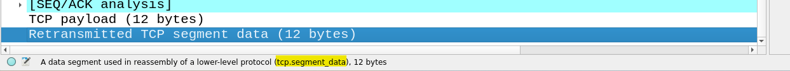

# picoCTF

On ouvre le fichier avec `wireshark myNetworkTraffic.pcap`

Il faut remarquer que :
- La colonne Time n'est pas classé dans l'ordre chronologique
- Certianes valeurs de Time sont négative, il s'agit de celles avec tcp.len=8
- Un morceau de chaine en b64 est présent dans chaque paquet

On va donc :
- filtrer les paquets de len 12 ou 4
- prendre les données time et segment_data (on peut cliquer sur le champ pour connaitre son chemin :  ) 
- classer par time
- déchiffrer

En one liner :

```
tshark -r myNetworkTraffic.pcap -Y "tcp.len==12 || tcp.len==4" -T fields -e frame.time -e tcp.segment_data | sort -k4 | awk '{print $6}' | xxd -p -r | base64 -d
```
tshark: Analyseur de protocole réseau (similaire à Wireshark, mais en ligne de commande).  
-r myNetworkTraffic.pcap: Lit les paquets depuis le fichier myNetworkTraffic.pcap.  
-Y "tcp.len==12 || tcp.len==4": Filtre les paquets TCP dont la longueur est de 12 ou 4 octets.  
-T fields: Affiche des champs spécifiques.  
-e frame.time: Affiche l'horodatage de la trame.  
-e tcp.segment_data: Extrait les données du segment TCP (la charge utile ou payload).  
sort -k4: Trie la sortie en fonction du 4ème champ (généralement l'horodatage).  
awk '{print $6}': Affiche le 6ème champ de la sortie triée, qui correspond aux données réelles du segment (la charge utile TCP).  
xxd -p -r: Convertit les données d'un dump hexadécimal en binaire (-r inverse le dump hexadécimal), de sorte que les données sont dans leur format brut.  
base64 -d: Décode les données brutes du format Base64 pour les retrouver sous leur forme binaire originale.


picoCTF{1t_w4snt_th4t_34sy_tbh_4r_959f50d3}